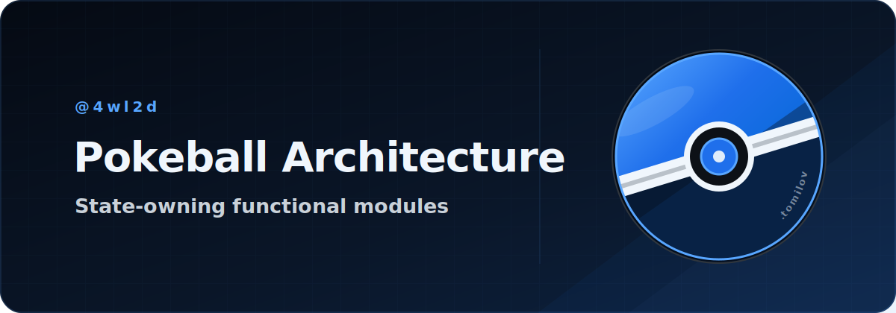
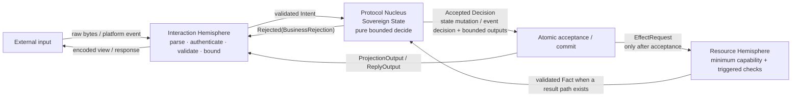
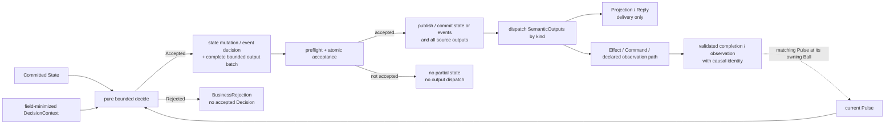
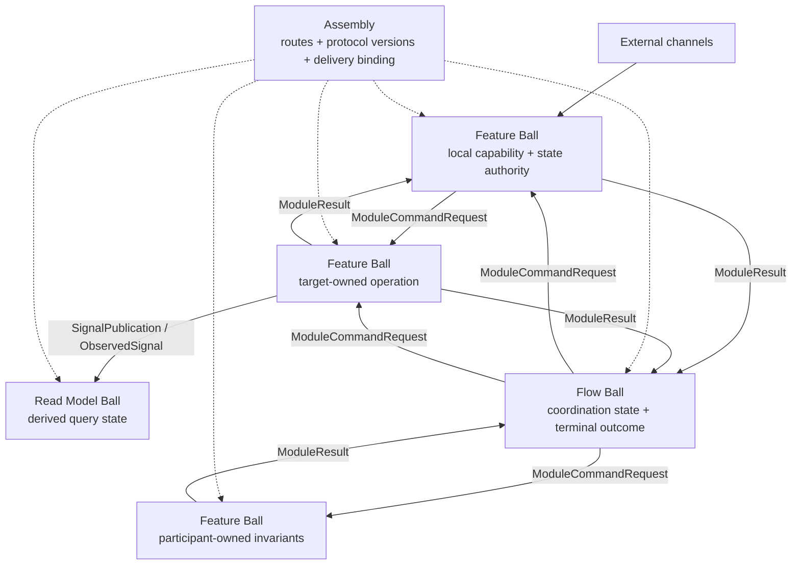

<h1 align="center">Pokeball</h1>

<p align="center">
  <a href="spec/pokeball-architecture-core.md">
    
  </a>
</p>

<p align="center">
  <strong>An architecture specification for applications built from explicitly composed, state-owning functional modules with pure bounded decisions, closed typed protocols, and evidence-qualified guarantees.</strong>
</p>

<p align="center">
  <a href="spec/pokeball-architecture-core.md"></a>
  <a href="docs/agents/README.md"></a>
  <a href="#adopt-pokeball"></a><br />
  <a href="docs/ru/README.md"></a>
  <a href="#documentation"></a>
  <a href="#license-and-authorship"></a>
</p>

<table>
  <tr>
    <td width="33%" align="center">
      <strong>Explicit ownership</strong><br />
      <sub>One explicit canonical state scope per Ball.</sub>
    </td>
    <td width="33%" align="center">
      <strong>Pure bounded decisions</strong><br />
      <sub>No I/O or ambient authority in the Nucleus.</sub>
    </td>
    <td width="33%" align="center">
      <strong>Closed typed protocols</strong><br />
      <sub>Only used paths, each with an effective finite bound.</sub>
    </td>
  </tr>
</table>

> [!IMPORTANT]
> The [Core specification](spec/pokeball-architecture-core.md) is the sole normative source for Pokeball. This README is an introduction, and the [Agent Pack](docs/agents/README.md) provides practical guidance derived from the Core. If they differ, the Core takes precedence.

This repository contains the Core specification and practical adoption guidance. It does not contain a Pokeball runtime, framework, library, or reference implementation.

## What problem does Pokeball address?

Stateful applications become difficult to reason about when state ownership, side effects, asynchronous results, authorization, retries, and delivery guarantees are implicit. Pokeball makes those decisions visible in the architecture:

- Who owns each mutable fact?
- Which exact inputs may change it?
- Which typed outputs may leave the module, and only after what acceptance point?
- How does an asynchronous result prove which operation caused it?
- Which queues, retries, fan-out, state, and work limits are finite?
- Which guarantees come from Core semantics, and which require a concrete runtime profile and evidence?

Pokeball does this without requiring a mediator, broker, queue, reflection, serialization, runtime DI container, or a particular database for a local `Inline` binding.

## The architecture in one sentence

A `Ball` is the smallest operationally feasible scope in which one authority can enforce the required invariants without reading another Ball's mutable state.

Each Ball:

1. owns one explicit canonical state scope;
2. separates external interaction, pure decision logic, and resource execution;
3. exposes only the closed typed protocol paths it actually uses;
4. atomically accepts its snapshot state mutation or `EventDecision` together with the complete semantic-output batch;
5. dispatches no `SemanticOutput` before that acceptance;
6. gives detached or independently observable work stable causal identity and verified provenance;
7. keeps every present variable dimension within one finite effective bound.

Pokeball has one sparse Core, not separate “Lite” and “full” architectures. Its always-applicable invariants remain universal. A reachable path or named risk activates only its guardrail; a concrete claim activates its evidence. Each activated guardrail resolves once through construction, a local declaration, or an exact immutable project-, profile-, Assembly-, or binding-scoped policy, with only permitted Ball-specific deltas. A proven-absent trigger needs no empty table, zero, `N/A`, or evidence placeholder.

A Ball is not automatically a screen, endpoint, table, repository, service, aggregate, or use case. Stateless helpers remain utilities; a one-hop call does not automatically become a workflow.

## One Ball at a glance



These are logical roles, not necessarily separate processes, classes, or heap objects.

- **Interaction Hemisphere** parses, validates, bounds, and encodes channel-specific data; it authenticates actor/origin only when that identity affects the decision. It cannot mutate canonical state or create business effects.
- **Protocol Nucleus** owns the Ball's `SovereignState` and is the only place that makes a local business decision. It performs no I/O and reads no ambient clock, random source, environment, service locator, or platform SDK.
- **Resource Hemisphere** executes a present private `Effect` through the minimum capability. It adds a safe sink at an interpreter edge and validates/maps a response to `Fact` only for a result-producing path; it does not make a new business decision.

The diagram shows a mutating resource cycle. A `Query` is separate and never mutates state or creates a `Decision`/`SemanticOutput`. It carries a consistency stamp when it crosses an authority or time boundary, can be cached or compared, proves status, aggregates sources, or makes a consistency claim; a same-stack getter may use call-scope snapshot identity.

## The decision and acceptance model

The canonical snapshot transition shape is:

```text
decide(
    state: State,
    pulse: Pulse,
    context: DecisionContext
) -> Accepted(Decision { nextState, boundedOutputs })
   | Rejected(BusinessRejection)
```

`Pulse` is a closed union of `Intent`, `Fact`, `ModuleResult`, `ObservedSignal`, and declared trusted `ControlPulse` variants. In snapshot form, a successful `Decision` contains the complete next state and an ordered, bounded batch of canonical `SemanticOutput` envelopes:

```text
ProjectionOutput | ReplyOutput | EffectRequest
ModuleCommandRequest | SignalPublication | TimerRequest
```

In `EventJournal` form, `Accepted(EventDecision)` contains either `EventMutation { events, outputs }` or `NoDomainChange { outputs }`; it does not return an independent `nextState`. The shared invariant is atomic acceptance of the snapshot state mutation or event decision together with the complete source-output batch.



The ordering is deliberate when outputs exist: **accept or commit first, dispatch second**. A crash or fault before acceptance cannot expose partial state or a partial accepted-output batch. For a present fallible delivery path, a fault after acceptance does not roll the Decision back and activates only its applicable retention, retry, status, or unknown-outcome contract.

Only outputs with a declared completion or observation path can later create a matching `Pulse` at the source or declared consumer. `ProjectionOutput` and `ReplyOutput` are delivery paths, not implicit result Pulses.

## How an application is composed

Pokeball distinguishes four application component roles:

| Role | Owns | Does not own |
|---|---|---|
| `Feature Ball` | A local business capability and its state authority | Another feature's internals or mutable state |
| `Flow Ball` | A specific multi-participant coordination lifecycle and terminal outcome | Participant domain facts or a global workflow engine |
| `Read Model Ball` | Derived query state, source positions, freshness, and rebuild policy | Command authority for source facts |
| Utility package | Pure stateless mechanics | State, protocol, lifecycle, or resource authority |



All inter-Ball dependencies are explicit and bounded. Each has an exact effective protocol identity; explicit versions appear when the endpoints can version or deploy independently. `Assembly` declares the wiring and delivery binding; it is not a runtime mediator and does not make business decisions. A `Flow Ball` is introduced when coordination has significant properties such as its own state or lifecycle, sequencing, compensation, reconciliation, deadlines, cancellation, manual intervention, or an independent terminal outcome.

## Core rules developers must preserve

The Core specification defines 43 canonical laws. The groups below are an orientation map, not a substitute for their exact wording. They do not require 43 local artifacts: Core §20.1 assigns each law an applicability class, exact trigger, declaration owner, enforcement or evidence owner, and reuse rule.

| Area | Developer-facing rule | Laws |
|---|---|---|
| Boundary and decision | Keep Interaction, Nucleus, and Resources logically separate. The Nucleus is pure, explicit, bounded, and the only source of semantic actions. Protocols are closed. | `PBA-01–06` |
| Acceptance and faults | Accept state and the full output batch atomically; dispatch only afterward; do not re-enter a transition; never expose partial acceptance. | `PBA-07–10` |
| State and identity | One mutable fact has one authority and one writer; state kinds remain distinct; detached or independently observable work uses stable semantic identity. | `PBA-11–18` |
| Async and delivery | When those paths exist, separate ACK/result and model ambiguity, idempotency, cancellation races, and retry ownership. | `PBA-19–24` |
| Composition | For actual inter-Ball edges and stateful coordination, declare dependencies/owners and bound routes and fan-out. | `PBA-25–30` |
| Security and resources | Apply quarantine, capabilities, gates, safe sinks, secret, and unsafe controls at the trust/resource/risk edges that exist; ambient authority is always prohibited. | `PBA-31–37` |
| Cost and claims | Keep every present variable dimension finite; reuse exact policies; require binding evidence only for a concrete claim. | `PBA-38–43` |

See [Core sections 18 and 20](spec/pokeball-architecture-core.md) for the practical implementation checklist and the exact laws.

## Profiles: pay only for the guarantees you use

Profiles are independent dimensions. Every selection preserves the always-applicable Core semantics and cannot waive a guardrail activated by its actual paths, risks, or claims.

A project or binding may select an exact default profile policy once; a Ball records only a permitted override.

| Dimension | Choices | What changes |
|---|---|---|
| Execution | `Inline` / `BoundedConcurrent` | Direct run-to-completion versus bounded mailbox and workers, while retaining a single writer |
| State | `Transient` / `SnapshotOutbox` / `EventJournal` | Process-memory lifetime versus durable source state/output records or event commits |
| Isolation | `InProcess` / `Isolated` | Logical in-process boundary versus process or sandbox containment with bounded IPC |
| Security | `Standard` / `Hardened` | Base discipline versus stronger actor, grant, capability, secret, and abuse-control requirements |
| Composition | `Static` | Explicit compile-time or generated wiring; no mandatory runtime registry |

Typical starting points from the Core:

- Local UI state machine: `Inline + Transient + InProcess + Standard`.
- Asynchronous mobile feature: `BoundedConcurrent + Transient/SnapshotOutbox + InProcess`.
- Durable backend aggregate: `BoundedConcurrent + SnapshotOutbox + InProcess + Hardened`.
- Hostile plugin or parser: `BoundedConcurrent + Transient/SnapshotOutbox + Isolated + Hardened`.

## Guarantee boundaries

Pokeball makes guarantees explicit, but it does not turn a label into proof:

- A timeout does not prove that an external action failed or never happened; use `OutcomeUnknown` and reconciliation where required.
- Cancellation is a protocol and a race, not an instant physical stop.
- For a conforming, evidenced `SnapshotOutbox` binding, the guarantee ends at durable source acceptance and retained source output/status within its stated contract. It does not by itself prove target receipt, target acceptance, business success, exactly-once execution, or unconditional eventual delivery.
- A `Flow Ball` coordinates participants; it does not create a distributed ACID transaction. Compensation is new fallible work, not time reversal.
- A multi-source read is not an atomic snapshot without a mechanism that provides one.
- `Hardened`, performance, zero-allocation, durability, and security claims require evidence from a concrete binding and threat/failure model.

Stronger durable runtime, distributed delivery, full replay, secure isolation, subscription, conformance, and dynamic-extension protocols are deliberately left to future extension specifications.

## A typical project layout

Physical folders are not normative, but the Core recommends a shape that makes dependency direction visible:

```text
features/
  catalog/
    interaction/
    nucleus/
      protocol/
      state/
      transition/
      policy/
    resources/
    ball.yaml            # optional/generated resolved view

flows/
  checkout/
    interaction/
    nucleus/
      protocol/
      state/
      transition/
    ball.yaml            # optional/generated resolved view

application/
  assembly/
  runtime/
  observability/

foundation/
  bounded/
  security/
  time/
  tracing/
```

`ball.yaml` is optional: typed source may be authoritative, while tools may generate a fully resolved view for deployment, review, or a conformance claim.

The important part is the direction of authority and dependencies: Interaction adapts external channels, Resources adapt external systems, the Nucleus depends only on its own state and protocols plus mechanical foundation, and Assembly depends only on public protocols and explicit route declarations. Feature internals and mutable state never become another feature's dependency.

## Adopt Pokeball

Start with one vertical slice rather than redesigning the whole application:

1. Assign one authority to each mutable semantic fact.
2. Choose the Ball boundary; materialize `StateKey` only when there can be multiple instances or identity crosses call scope.
3. Define only the used closed inputs, state, and outputs.
4. Implement pure bounded `decide` before introducing a framework or DSL.
5. Inventory reachable paths, risks, selected profiles, and intended claims.
6. Resolve each applicable guardrail once through construction, a local declaration, or an exact project/binding policy plus permitted delta.
7. Add adapters, revisions, handles, stale-result, retry, cancellation, status, security, and durability only when first triggered.
8. Test base semantics, triggered paths, and local deltas; test shared mechanisms once at their scope.
9. Add dependencies and Assembly routes only for actual inter-Ball edges.
10. Create evidence only for claims actually made; generate a fully resolved contract view only when deployment or conformance review needs it.

For agent-assisted adoption in another repository, start with the [Agent Pack](docs/agents/README.md). It can guide ordinary design without a fully populated overlay. Its [installation guide](docs/agents/INSTALL.md) explains how to select exact reusable project policies and Ball deltas; an accepted resolved project contract and claim evidence are required before making a Pokeball conformance claim.

## Documentation

### Where to start

- **Learn the architecture:** read this overview, then Core §§0–3 for scope and semantics and §§4–10 for boundaries, state, protocols, and composition.
- **See complete flows:** study the Catalog and Checkout walkthroughs in Core §§15–16.
- **Apply Pokeball:** use the [Agent Pack](docs/agents/README.md) for design and review guidance, and follow its [installation guide](docs/agents/INSTALL.md) when bringing it into another repository.

### Suggested Core reading order

1. §§0–3 — scope, goals, identities, and the decision model.
2. §§4–10 — Ball boundaries, protocols, state, acceptance, async semantics, and composition.
3. §12 — profile selection.
4. §§15–16 — Catalog and Checkout examples.
5. §§18–20 — checklist, anti-patterns, and canonical laws.
6. §§11, 13, 14, 17, 21, and 22 — security, limits, manifests, testing, adoption, and glossary reference.

### Main documents

| Document | What it contains |
|---|---|
| [Core specification](spec/pokeball-architecture-core.md) | Complete Core specification, examples, laws, checklist, and glossary |
| [Agent Pack](docs/agents/README.md) | Practical guidance and runbooks derived from the Core for applying Pokeball in another project |
| [Russian overview](docs/ru/README.md) | Russian-language introduction to the architecture |
| [License](LICENSE) and [notice](NOTICE.md) | License terms, authorship, scope, and reusable attribution |

## License and authorship

Copyright © 2026 **Vladislav Tomilov (4wl2d)**. `4wl2d` is his public
pseudonym. The original specification, documentation,
diagrams, examples, and Agent Pack are licensed under
[Creative Commons Attribution 4.0 International](https://creativecommons.org/licenses/by/4.0/)
(`CC-BY-4.0`). Anyone may share and adapt those materials for any purpose,
including commercial use, subject to CC BY 4.0: retain the supplied creator,
copyright, license, and warranty-disclaimer notices; include the license text
or URL; link the source to the extent reasonably practicable; and indicate
changes while retaining prior change notices. No ShareAlike condition applies.

This licenses the copyrightable expression of Pokeball Architecture; it does
not create exclusive copyright ownership in abstract ideas, methods, systems,
or functional concepts. CC BY 4.0 does not grant patent or trademark rights.
See [`NOTICE.md`](NOTICE.md) for the exact scope and recommended attribution,
and [`LICENSE`](LICENSE) for the complete legal code.
