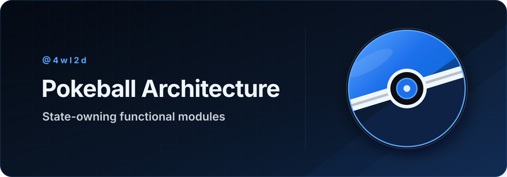

<h1 align="center">Pokeball</h1>

  

  <strong>Stateful features with one owner, pure decisions, and explicit effects.</strong>

  <a href="docs/QUICKSTART.md">Write your first feature</a> ·
  <a href="docs/EVALUATION.md">Decide whether it pays off</a> ·
  <a href="docs/SKILLS.md">Agent skills</a> ·
  <a href="spec/pokeball-architecture-core.md">Core specification</a> ·
  <a href="docs/ru/README.md">Russian</a>

Pokeball is an architecture specification for stateful applications. A feature owns its state, makes decisions in a pure function, and performs external actions only after accepting the decision. It can start as one source file with ordinary types and functions.

**Start with the [human quickstart](docs/QUICKSTART.md).** It shows a complete local feature, its tests, and a business-rule change before introducing asynchronous work. You do not need to master the full reference before making an ordinary change inside an established project binding.

## Why use it?

Consider a search that starts A, then B, but receives A's result last; or a payment that times out after the provider may have charged the customer. Layers and dependency direction alone do not select how your application handles these situations.

Pokeball gives a team explicit contracts for recurring questions:

- **State ownership:** one authority and one logical writer for each mutable fact.
- **Decisions and consequences:** decide from State and explicit current input/context; accept State and all present outputs together; dispatch afterward.
- **Asynchronous work:** associate results with accepted causes, reject or handle stale results by policy, and distinguish a timeout from a known failure.
- **Bounded operation:** resolve finite limits for present variable dimensions and name the evidence behind stronger guarantees.

These contracts can make reviews and failure handling more consistent. They also cost design, code, tests, and learning. The [value comparison and pilot](docs/EVALUATION.md) explains how to measure both.

Good Clean Architecture can use the same mechanisms. Pure functions, isolated tests, and replaceable adapters are shared benefits; Pokeball's additional value is a common, explicit contract for stateful behavior. If your project already has equivalent rules and checks, adopting another vocabulary may add little.

## What do I write?

| Everyday code | Pokeball term | Responsibility |
|---|---|---|
| A state-owning feature module | Ball | Own the fact, its invariant, and lifecycle. |
| Input adapter | Interaction | Validate/adapt the present input channel; keep business choices in the decision. |
| Pure decision and read functions | Nucleus | Compute the proposed change or read result from explicit values. |
| Adapter for an external action | Resources | Execute only accepted requested work through the required boundary. |

The binding connects these roles and enforces the writer, acceptance, and applicable execution rules. A small project can implement it directly; an established project can reuse it. It is real integration work, not something this specification supplies.

For a local state-only feature, the Resource role is empty. Three logical roles do not require three classes, folders, interfaces, or a message bus. Source types, calls, verification sites, and the single accepted-write site can carry the role map; a separate document is unnecessary when those facts are already inspectable.

## How much machinery is required?

There is one Core. Always-applicable invariants remain in force; optional machinery appears when a real path, risk, or claim activates it.

| Situation | Start with |
|---|---|
| Local state and synchronous calls | Owned State, closed typed input, pure decision, serial atomic publication, relevant tests. |
| Detached external work | Accepted outputs, verified result correlation, bounded execution, and the required operation-status contract. |
| Accepted work must survive process loss | A concrete durable binding, crash/recovery tests, and explicit external-outcome handling. |
| Multiple authorities need an independent workflow | A Flow owner for the actual coordination and terminal outcome. |

No standalone manifest, empty protocol category, unused adapter, runtime DI container, or per-feature copy of an unchanged shared policy is required. A present obligation still needs a real mechanism. Learn the details when the task activates them through [adoption](docs/ADOPTION.md), [composition](docs/COMPOSITION.md), and [Core's everyday workflow](spec/core/reference/21-adoption.md#217-everyday-development-and-production-responsibility).

## Is it appropriate for production?

Production readiness belongs to an implemented system and its exact binding, workload, and guarantees. This repository provides the specification, teaching examples, and verification routes; it contains no runtime, library, reference implementation, comparative benchmark, or evidence for your deployment. Version and compatibility status are owned by the [Core header](spec/pokeball-architecture-core.md).

Use one real slice to check failure behavior, implementation cost, and a human's first change. Include shared setup and maintenance cost. Continue when the benefit is demonstrated within your budget; reshape or stop when the existing approach satisfies the same requirements more simply. Use ordinary utilities or adapters for stateless mechanics and passive paths that need no state-owning decision module. Pokeball does not promise an advantage on every project.

Follow the [project evaluation and production evidence guide](docs/EVALUATION.md). Documentation consistency and agent walkthroughs do not establish human usability or production reliability.

## Agent skills

Give your coding agent a practical Pokeball workflow with the [official skills](docs/SKILLS.md). Start with `pokeball` for everyday feature changes; add `pokeball-async`, `pokeball-composition`, `pokeball-binding`, or `pokeball-review` for those tasks. Short entrypoints lead to only the source sections needed for the work, while the canonical Core stays in one place.

[Download and install from GitHub](docs/SKILLS.md#download-once), then connect only the skills you want. The same page explains explicit Git updates. Skills provide coding workflows; the [Agent Pack](docs/agents/README.md) provides the broader contract, runbooks and review gates. Neither supplies an application runtime or a conformance verdict. Contributors should follow the [skill authoring guide](docs/SKILL-AUTHORING.md) when changing a skill or a source it uses.

## Documentation

| Start here when you want to… | Document |
|---|---|
| Write and change a small feature | [Human quickstart](docs/QUICKSTART.md) |
| Compare benefits, cost, and production fit | [Project evaluation](docs/EVALUATION.md) |
| Select profiles and adopt incrementally | [Adoption guide](docs/ADOPTION.md) |
| Understand decisions and logical roles | [Architecture guide](docs/ARCHITECTURE.md) |
| Choose boundaries, dependencies, and Flow ownership | [Composition guide](docs/COMPOSITION.md) |
| Resolve an exact rule or audit the architecture | [Core specification](spec/pokeball-architecture-core.md) |
| Give an agent focused coding workflows | [Skills, installation and updates](docs/SKILLS.md) |
| Apply the full agent contract in another repository | [Agent Pack](docs/agents/README.md) and [installation](docs/agents/INSTALL.md) |
| Read the localized overview | [Russian overview](docs/ru/README.md) |

The Core entrypoint and its ordered manifest form the canonical specification. Each marked source clause owns its law; guides, examples, law indexes, and the Agent Pack are derived views. If a view conflicts with its source clause, Core controls. Ordinary work follows affected sources and tests; a full audit still covers every unique source.

## License and authorship

Copyright © 2026 **Vladislav Tomilov (4wl2d)**. `4wl2d` is his public
pseudonym. The original specification, documentation,
diagrams, examples, and Agent Pack are licensed under
[Creative Commons Attribution 4.0 International](https://creativecommons.org/licenses/by/4.0/)
(`CC-BY-4.0`). Anyone may share and adapt those materials for any purpose,
including commercial use, subject to CC BY 4.0: retain the supplied creator,
copyright, license, and warranty-disclaimer notices; include the license text
or URL; link the source to the extent reasonably practicable; and indicate
changes while retaining prior change notices. No ShareAlike condition applies.

This licenses the copyrightable expression of Pokeball Architecture; it does
not create exclusive copyright ownership in abstract ideas, methods, systems,
or functional concepts. CC BY 4.0 does not grant patent or trademark rights.
See [`NOTICE.md`](NOTICE.md) for the exact scope and recommended attribution,
and [`LICENSE`](LICENSE) for the complete legal code.
