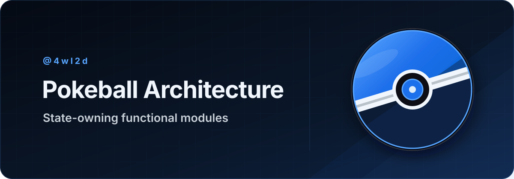

<h1 align="center">Pokeball</h1>

<p align="center">
  <a href="spec/pokeball-core-2.0.md">
    
  </a>
</p>

<p align="center">
  <strong>Stateful features with one owner, pure decisions, and explicit effects.</strong>
</p>

<p align="center">
  <a href="docs/tutorial.md">Write your first feature</a> ·
  <a href="docs/decision-guide.md">Decide whether it pays off</a> ·
  <a href="skills/pokeball-core-2/">Agent skill</a> ·
  <a href="spec/pokeball-core-2.0.md">Core specification</a> ·
  <a href="https://github.com/4wl2d/Pokeball/tree/1bb9e0ecca4d4d1c8b39327c93988c1b490f303e/docs/ru">Russian documentation (Core 1.5)</a>
</p>

**Pokeball Core 2.0** is a small architecture for stateful applications that talk to unreliable systems. Each piece of mutable state has one owner, a *Ball*. A Ball decides in pure functions, and a runtime executes its decisions. The runtime tracks every outbound call and gives it exactly one honest outcome: `Done`, `NotDone`, or `Unknown`.

The [specification](spec/pokeball-core-2.0.md) defines the current version and status. The Kotlin reference implementation supports its conformance checks and examples; it has not been used in production and has no production durable store. See the [migration guide](docs/migration-from-1.5.md) for the changes from Core 1.5.

**Start with the [tutorial](docs/tutorial.md).** Build a reminder with a pure decider, a timer, an external call, and tests for faults and crashes.

## The idea in one example

```kotlin
object OrderDraftBall : Ball<Draft, DraftRequest, DraftReply> {
    override val type = "order-draft"
    override fun initial(key: String) = Draft(quantity = 1)

    override fun decide(state: Draft, request: DraftRequest, ctx: RequestContext) = when (request) {
        is DraftRequest.SetQuantity ->
            if (request.value in 1..20) accept(Draft(request.value), DraftReply.Quantity(request.value))
            else reject(DraftReply.OutOfRange)
        DraftRequest.GetQuantity -> accept(state, DraftReply.Quantity(state.quantity))
    }
}
```

A decision may also contain *outputs*: calls to ports, replies, notices, and cancellations. The runtime commits the new state and the outputs atomically, sends nothing before that commit, and later delivers each call's single completion to `complete`. Which outcome a call can end in depends on the port's effect class. A read (`Safe`) never ends `Unknown`. A card charge (`NonIdempotent`) is never re-sent, and after a timeout or crash it ends `Unknown` rather than a false `NotDone`. [The payment example](reference/kotlin/examples/shop/payments/src/main/kotlin/pokeball/examples/shop/payments/PaymentBall.kt) shows reconciliation after `Unknown`.

## Costs and limits

The architecture makes ownership, effects, and uncertain outcomes explicit. That costs types, code, runtime work, and module boundaries. It does not promise less code than a plain class or an expert's implementation. Stateless transformations and simple local features may be better served by ordinary code.

The reference tests and bounded model checks are available to run. They do not establish production reliability, team productivity, or an advantage over another architecture. Historical prototype measurements and their limits are described in [Core §10](spec/pokeball-core-2.0.md#10-trade-offs-and-known-limitations); their full experimental data and comparison harness are not part of this distribution. Use the [decision guide](docs/decision-guide.md) to assess a real slice of your application.

## Repository map

| Path | Contents |
|---|---|
| [`spec/pokeball-core-2.0.md`](spec/pokeball-core-2.0.md) | The normative specification: model, execution semantics, rules R1–R13, profiles, conformance |
| [`reference/kotlin/`](reference/kotlin/) | Kernel, reference runtime, test kit, architecture rules, examples, and conformance tests |
| [`formal/alloy/`](formal/alloy/) | Alloy 6 model of the call protocol: 6 safety properties, 1 liveness property, 6 seeded runtime bugs |
| [`docs/`](docs/) | Tutorial, decision guide, FAQ, anti-patterns, migration, and verification commands |
| [`skills/`](skills/) | A short agent skill for Core 2 feature work (unevaluated) |
| [`tools/`](tools/) | Link and snippet checks for the documentation |
| [`assets/`](assets/) | Repository artwork |

The [previous published Core 1.5 documentation](https://github.com/4wl2d/Pokeball/tree/1bb9e0ecca4d4d1c8b39327c93988c1b490f303e), including its Russian edition, remains in Git history.

## Try it

Requires JDK 21. From `reference/kotlin`:

```sh
./gradlew build checkModuleBoundaries   # tests, architecture rules, examples
./gradlew :pokeball-runtime:pitest       # optional mutation testing
```

Start with the [tutorial](docs/tutorial.md). The [verification guide](docs/reproducibility.md) explains the available checks and their limits. For agent assistance, copy the complete [`pokeball-core-2`](skills/pokeball-core-2/) skill directory; its instructions are self-contained and unevaluated.

## License and authorship

Copyright © 2026 **Vladislav Tomilov (4wl2d)**.

Text and diagrams are licensed under [CC BY 4.0](LICENSE); see [NOTICE.md](NOTICE.md). **The code has no software license yet.** A software license remains the copyright holder's decision.

Pokeball Architecture by Vladislav Tomilov (4wl2d).
