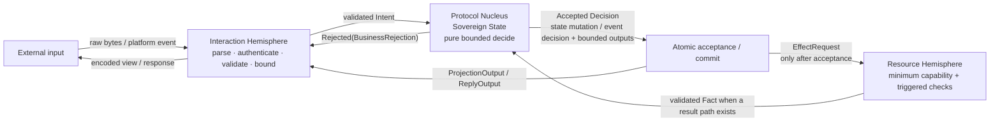
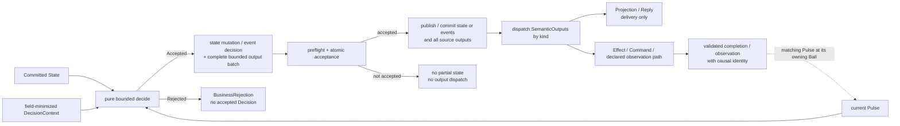

# Pokeball Architecture Guide

> [!NOTE]
> This is a non-normative reading guide. The ordered Core document set rooted at [`spec/pokeball-architecture-core.md`](../spec/pokeball-architecture-core.md) is the sole normative authority; if this guide differs from a marked Core source clause, Core controls.

[← Pokeball overview](../README.md) · **Architecture** · [Composition](COMPOSITION.md) · [Adoption](ADOPTION.md) · [Agent Pack](agents/README.md)

Use this guide for the Ball model, logical zones, accepted decisions, output discipline, and the developer-facing law map.

For your first feature, begin with the [human quickstart](QUICKSTART.md): ordinary types, a pure function, one state owner, and a visible acceptance point. Use this page to resolve the detailed concepts that example or your next change introduces. The complete protocol catalog is a reference, not a set of types to create in every feature.

## One Ball at a glance



**Arrow legend.** Solid arrows show semantic input/output direction between logical roles; no arrow transfers state, policy, resource, or business authority.

These are logical roles, not necessarily separate processes, classes, or heap objects.

- **Interaction Hemisphere** parses, validates, bounds, and encodes channel-specific data; it authenticates actor/origin only when that identity affects the decision. It cannot mutate canonical state or create business effects.
- **Protocol Nucleus** owns the Ball's `SovereignState` and is the only place that makes a local business decision. It performs no I/O and reads no ambient clock, random source, environment, service locator, or platform SDK.
- **Resource Hemisphere** executes a present private `Effect` through the minimum explicit technical authority for its bounded operation class, enforced at a real capability boundary. It uses the applicable parameterized, structured, capability-rooted, or context-encoded safe sink at an interpreter or dialect edge and validates/maps a response to `Fact` only for a result-producing path; it does not make a new business decision.

The diagram shows a mutating resource cycle. A `Query` is separate and never mutates state or creates a `Decision`/`SemanticOutput`. It carries a consistency stamp when it crosses an authority or time boundary, can be cached or compared, proves status, aggregates sources, or makes a consistency claim; a same-stack getter may use call-scope snapshot identity.


## The decision and acceptance model

The canonical snapshot transition shape is:

```text
decide(
    state: State,
    pulse: Pulse,
    context: DecisionContext
) -> Accepted(Decision { nextState, boundedOutputs })
   | Rejected(BusinessRejection)
```

`Pulse` is the following exact ordered closed union:

```text
Pulse =
    Intent
  | Fact
  | ModuleCommandPulse
  | ModuleResultPulse
  | ObservedSignal
  | ControlPulse
```

In snapshot form, a successful `Decision` contains the complete next state and this exact ordered, bounded union of canonical `SemanticOutput` envelopes:

```text
SemanticOutput =
    ProjectionOutput
  | ReplyOutput
  | EffectRequest
  | ModuleCommandRequest
  | ModuleResultOutput
  | SignalPublication
  | TimerRequest
```

Bare `ModuleResult` is not a `Pulse`; `SignalOutput` does not exist; and `TimerFired` is not a top-level `Pulse` but may remain a declared timer `ControlPulse`. `ObservedSignal`, `ProjectionOutput`, and `SignalPublication` remain first-class protocol variants.

In `EventJournal` form, `Accepted(EventDecision)` contains either `EventMutation { events, outputs }` or `NoDomainChange { outputs }`; it does not return an independent `nextState`. The shared invariant is atomic acceptance of the snapshot state mutation or event decision together with the complete source-output batch.



**Arrow legend.** Solid arrows show the current transition, acceptance, and post-acceptance dispatch; the dotted arrow is a later verified matching `Pulse`, never rollback or a reentrant nested transition.

The ordering is deliberate when outputs exist: **accept or commit first, dispatch second**. A crash or fault before acceptance cannot expose partial state or a partial accepted-output batch. For a present fallible delivery path, a fault after acceptance does not roll the Decision back and activates only its applicable retention, retry, status, or unknown-outcome contract.

Only outputs with a declared completion or observation path can later create a matching `Pulse` at the source or declared consumer. `ProjectionOutput` and `ReplyOutput` are delivery paths, not implicit result Pulses.

### Inter-Ball command/result bridge

`ModuleCommand` and `ModuleResult` are payload types owned by the target contract. Their canonical bridge is:

1. the source accepts `ModuleCommandRequest` in its Decision;
2. the trusted target boundary verifies the accepted source frame, protocol identity, ownership, bounds, and provenance before constructing `ModuleCommandPulse`;
3. target `decide` is the sole target acceptance point and can create `ModuleResultOutput` only inside an accepted target Decision;
4. the verified result route derives `resultSource` from that accepted target frame and constructs `ModuleResultPulse` for the source while preserving the accepted `commandSource`.

Assembly selects the route, effective protocol/version pair, and ingress/return bindings and transports only verified values. It cannot synthesize or modify `commandSource`, `resultSource`, a command/result payload, refusal classification or reason, or any other business meaning; generated same-stack wiring must prove the same accepted source and target tuples.

Before target acceptance, `CommandRejectedBeforeAcceptance` may carry only a verified `ValidationFailure`, `AdmissionFailure`, or `DecisionRejected(BusinessRejection)`. It is neither `ReplyOutput` nor `ModuleResult`, creates no accepted target Decision/revision/output, and reaches source state only through a typed mechanical `ControlPulse`; at the source it means `RejectedBeforeAcceptance + NotExpected`, not an accepted rejected outcome. A refusal that creates a target-owned record, replay result, status/reconciliation fact, Resource action, output, or other accepted-operation evidence is instead an accepted `ModuleResultOutput`; at the source its verified result can mean `Accepted + Rejected`. This classification is versioned target-contract meaning, and a later failure never downgrades an accepted result to the carrier.

A read-like command deliberately pays target acceptance and revision cost when its caller needs a provenance-bound accepted result, stable command/step identity, idempotent replay, status, or reconciliation. Otherwise it is a `ReadDependency`/`Query`, which creates no target Decision, revision, semantic output, or accepted operation record.

If a target crashes after accepting `ModuleResultOutput` but before dispatch, the result remains an accepted target fact under the selected profile. Result-route exhaustion creates target `DispatchStopped` keyed by `(effectiveProtocolIdentity, commandSource, resultSource)`; it does not fabricate source receipt or change a source business/status facet. The source remains at its already proven `Pending`, `AcceptanceUnknown`, or `OutcomeUnknown` state until a verified result Pulse, separate ACK, or declared reconciliation evidence arrives.


## Core rules developers must preserve

The Core specification has 44 stable law identifiers. Section 20 is the complete generated audit projection of the marked body source records; §20.1 is only the compact applicability, ownership, and navigation index. Neither is independent authority. The groups below are also an orientation map and do not require 44 local artifacts.

| Area | Developer-facing rule | Laws |
|---|---|---|
| Boundary and decision | Keep Interaction, Nucleus, and Resources logically separate. The Nucleus is pure, explicit, bounded, and the only source of semantic actions. Protocols are closed. | `PBA-01–06` |
| Acceptance and faults | Accept state and the full output batch atomically; dispatch only afterward; do not re-enter a transition; never expose partial acceptance. | `PBA-07–10` |
| State and identity | One mutable fact has one authority and one writer; state kinds remain distinct; detached or independently observable work uses stable semantic identity. | `PBA-11–18` |
| Async and delivery | When those paths exist, separate ACK/result and model ambiguity, idempotency, cancellation races, and retry ownership. | `PBA-19–24` |
| Composition | For actual inter-Ball edges and stateful coordination, declare dependencies/owners and bound routes and fan-out. | `PBA-25–30` |
| Security and resources | Apply quarantine, actor-context authenticity, real capability boundaries, safe sinks including capability-rooted forms, and exact-path-and-scope secret/unsafe controls at the trust/resource/risk edges that exist; ambient authority is always prohibited. | `PBA-31–37, PBA-44` |
| Cost and claims | Keep every present variable dimension finite; reuse exact policies; qualify each concrete claim by its named boundary, scope, assumptions, retention, and evidence without implying a stronger downstream guarantee. | `PBA-38–43` |

See [Core sections 18 and 20](../spec/pokeball-architecture-core.md) for the practical implementation checklist and the exact laws.


---

[← Pokeball overview](../README.md) · [Next: Composition →](COMPOSITION.md)
