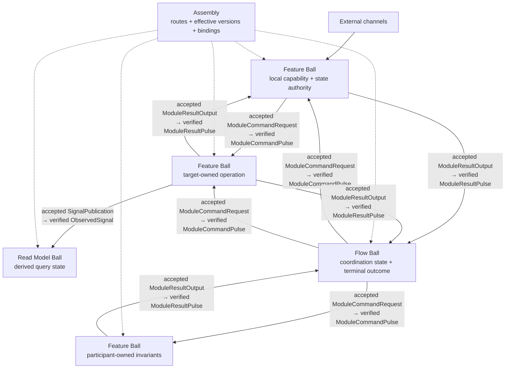

# Pokeball Composition Guide

> [!NOTE]
> This is a non-normative reading guide. The ordered Core document set rooted at [`spec/pokeball-architecture-core.md`](../spec/pokeball-architecture-core.md) is the sole normative authority; if this guide differs from a marked Core source clause, Core controls.

[← Pokeball overview](../README.md) · [Architecture](ARCHITECTURE.md) · **Composition** · [Adoption](ADOPTION.md) · [Agent Pack](agents/README.md)

Use this guide for application roles, inter-Ball dependencies, command/result routes, reads, status authority, security context, and mechanical Foundation.

For a change inside one state owner, start from its source and decision function. Use this guide when a real dependency or boundary choice appears; a helper call or a new folder alone does not create a Flow. The [human quickstart](QUICKSTART.md) shows the local case, and [project evaluation](EVALUATION.md) measures whether a larger decomposition is paying for itself.

## How an application is composed

Pokeball distinguishes four application component roles:

| Role | Owns | Does not own |
|---|---|---|
| `Feature Ball` | A local business capability and its state authority | Another feature's internals or mutable state |
| `Flow Ball` | A specific multi-participant coordination lifecycle and terminal outcome | Participant domain facts or a global workflow engine |
| `Read Model Ball` | Derived query state, source positions, freshness, and rebuild policy | Command authority for source facts |
| Utility package | Pure stateless mechanics | State, protocol, lifecycle, or resource authority |

**Arrow legend.** Solid arrows show protocol direction: an accepted source output becomes a verified later target/source Pulse. Dashed arrows show static Assembly route, effective-version, and binding selection—not execution, business authority, or a `Direct Control Dependency` edge by themselves.

All semantic inter-Ball dependencies are explicit and bounded. Physical helper imports remain in the acyclic compile-time graph but are not a fifth semantic dependency kind. Each semantic edge has an exact effective protocol identity; explicit versions appear when the endpoints can version or deploy independently. `Assembly` declares route/version/binding only; it is not a runtime mediator, payload constructor, refusal classifier, or business authority.

When `maxCumulativeFanout` applies, it counts each distinct accepted source-output-to-effective-route/consumer branch once across one root causal scope. Terminal and converging traversals count, co-reachable branches sum, mutually exclusive alternatives share their maximum reservation, retry/redelivery of the same tuple and route does not add a unit, and async handoff preserves the remaining scope. Exact `N+1` rejects the whole over-limit Decision before acceptance and dispatches no partial batch.

**Material coordination** exists when one authority must own any independent workflow lifecycle, semantic ordering or branch/join, compensation or recovery, cancellation, reconciliation, or terminal outcome across participant authorities. One such property is sufficient when it makes the simple one-hop conditions false. Call count, sequential syntax, or one command round trip alone is not material coordination and does not require a `Flow Ball`.

### Reads, Draining, and status authority

A cross-authority `ReadDependency` resolves exactly one target authority, target-owned `Query -> ResultPayload` mapping and effective protocol identity, target read/status authority, caller freshness/consistency requirement, and Assembly route/binding. Caller and Assembly do not redefine the target result, stamp, status fact, or read meaning. Multiple reads remain independent and do not promise one atomic multi-source snapshot without a separate declared mechanism.

`Draining` rejects new logical mutations but serves every available declared `Query` and status Query from its committed authority. If the read authority is unavailable, the trusted boundary can return an existing validation/admission response before `read`; once admitted, `read(...) -> ReadResult` remains successful and creates no Decision.

Each status namespace has exactly one committed, revisioned, single-writer query authority without taking command authority over the underlying business facts. `OperationId` identifies an accepted root operation: reserving a candidate before `decide`, or rejecting root validation/admission/Decision before acceptance, creates no operation, handle, output, known status row, or retention marker. A covered committed snapshot may return `NotFound`; downstream target nonacceptance remains a Step facet of an already accepted source operation. Co-location can reduce lag and transaction boundaries; a separate status/Read Model authority can isolate query load and combine declared sources but pays materialization lag and source-position evidence. Neither choice permits two independently writable status answers.

### Security, context, and foundation

When actor, tenant, issuer, realm, assurance, or delegation can change a `Decision` or `Query`/status-read authorization or result selection, the trusted binding boundary constructs verified, bounded, field-minimized context against an approved issuer or equivalent fixed trusted same-stack proof. Forged, tampered, wrong-issuer/realm, missing, stale, or otherwise unverifiable required evidence fails closed. Actor-independent Decisions and reads create no actor-context, issuer, authentication, or actor-evidence artifacts.

The Nucleus Policy Gate alone decides business permission from committed State, the current cause or Query, and trusted context. Immediately before authoritative execution, the Resource/target Execution Gate verifies every triggered proof, capability, constraint, version, freshness/revocation, endpoint, quota, and safe-sink binding without making a new business decision. A post-acceptance gate failure remains a declared Resource/result/status path; it cannot roll back or downgrade accepted work or become a pre-acceptance carrier.

Shared foundation code contains mechanical primitives only. It owns no mutable business meaning, business-policy decision, domain or status authority, route selection, service locator, or hidden communication state. An ownerless shared domain/business utility is prohibited: keep the semantics Ball-local, including deliberate small duplication, or assign one Ball/Flow owner and expose its declared Application Surface/protocol.

---

[← Architecture](ARCHITECTURE.md) · [Pokeball overview](../README.md) · [Next: Adoption →](ADOPTION.md)
