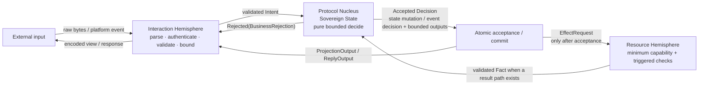
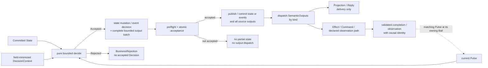

<!-- pkb:translation source="docs/ARCHITECTURE.md" -->

[Документация на русском](README.md) · [Оригинал на английском](../ARCHITECTURE.md)

> Русский перевод для чтения. Нормативный источник — [английский Core](../../spec/pokeball-architecture-core.md).

<a id="pokeball-architecture-guide"></a>

# Руководство по архитектуре Pokeball

> [!NOTE]
> Это руководство для чтения, а не нормативный документ. Единственный нормативный источник — упорядоченный набор документов Core с точкой входа [`spec/pokeball-architecture-core.md`](spec/pokeball-architecture-core.md). При расхождении с отмеченным исходным положением Core действует Core.

[← Обзор Pokeball](README.md) · **Архитектура** · [Композиция](COMPOSITION.md) · [Внедрение](ADOPTION.md) · [Agent Pack](agents/README.md)

Руководство объясняет модель Ball, логические зоны, принятые решения, правила выходов и карту законов для разработчика.

Для первой функции приложения начните с [быстрого старта](QUICKSTART.md): обычные типы, чистая функция, один владелец состояния и видимая точка принятия. На этой странице уточняйте понятия, которые появляются в примере или следующем изменении. Полный каталог протокола — справочник, а не набор типов, которые нужно создавать в каждой функции приложения.

<a id="one-ball-at-a-glance"></a>

## Один Ball на схеме



**Обозначения стрелок.** Сплошные стрелки показывают направление семантических входов и выходов между логическими ролями; ни одна не передаёт полномочия над состоянием, правилами, ресурсами или бизнес-решениями.

Это логические роли, которые не обязательно воплощаются в отдельных процессах, классах или объектах в куче.

- **Interaction Hemisphere** разбирает, проверяет, ограничивает и кодирует данные конкретного канала; подлинность актора/источника проверяется только тогда, когда эта идентичность влияет на решение. Interaction не может менять каноническое состояние или создавать бизнес-эффекты.
- **Protocol Nucleus** владеет `SovereignState` своего Ball и только он принимает локальные бизнес-решения. Он не выполняет I/O и не читает неявные часы, генератор случайных чисел, окружение, локатор сервисов или SDK платформы.
- **Resource Hemisphere** исполняет имеющийся закрытый `Effect` с минимальными явными техническими полномочиями для его ограниченного класса операций; эти полномочия принудительно ограничены реальной границей capability. На границе интерпретатора или диалекта он использует применимый безопасный приёмник: параметризованный, структурированный, привязанный к корню capability или с кодированием по контексту. Ответ проверяется и преобразуется в `Fact` только на пути, который производит результат; новое бизнес-решение здесь не принимается.

Схема показывает цикл работы с ресурсом, который меняет состояние. `Query` существует отдельно и никогда не меняет состояние и не создаёт `Decision`/`SemanticOutput`. Он несёт метку согласованности, если пересекает границу владельца полномочий или времени, может кэшироваться или сравниваться, доказывает статус, объединяет источники либо заявляет согласованность; геттер в том же стеке может использовать идентичность снимка в области вызова.

<a id="the-decision-and-acceptance-model"></a>

## Модель решения и принятия

Каноническая форма перехода со снимком:

```text
decide(
    state: State,
    pulse: Pulse,
    context: DecisionContext
) -> Accepted(Decision { nextState, boundedOutputs })
   | Rejected(BusinessRejection)
```

`Pulse` — следующее закрытое объединение с точным порядком:

```text
Pulse =
    Intent
  | Fact
  | ModuleCommandPulse
  | ModuleResultPulse
  | ObservedSignal
  | ControlPulse
```

В форме снимка успешный `Decision` содержит полное следующее состояние и это точное упорядоченное ограниченное объединение канонических оболочек `SemanticOutput`:

```text
SemanticOutput =
    ProjectionOutput
  | ReplyOutput
  | EffectRequest
  | ModuleCommandRequest
  | ModuleResultOutput
  | SignalPublication
  | TimerRequest
```

Сам по себе `ModuleResult` не является `Pulse`; `SignalOutput` не существует; `TimerFired` не является вариантом `Pulse` верхнего уровня, но может оставаться объявленным таймерным `ControlPulse`. `ObservedSignal`, `ProjectionOutput` и `SignalPublication` остаются самостоятельными вариантами протокола.

В форме `EventJournal` результат `Accepted(EventDecision)` содержит либо `EventMutation { events, outputs }`, либо `NoDomainChange { outputs }`; он не возвращает отдельный `nextState`. Общий инвариант — атомарное принятие изменения снимка состояния или решения на основе событий вместе со всем пакетом выходов источника.



**Обозначения стрелок.** Сплошные стрелки показывают текущий переход, принятие и отправку после принятия; пунктир — последующий проверенный соответствующий `Pulse`, а не откат или вложенный повторный вход в переход.

При наличии выходов порядок задан намеренно: **сначала принять или зафиксировать, затем отправить**. Авария или сбой до принятия не может открыть частичное состояние или частично принятый пакет выходов. Если есть путь доставки, который может дать сбой, отказ после принятия не откатывает Decision и включает только применимый контракт хранения, повторов, статуса или неизвестного исхода.

Только выходы с объявленным путём завершения или наблюдения могут позже создать соответствующий `Pulse` у источника или объявленного потребителя. `ProjectionOutput` и `ReplyOutput` — пути доставки, а не неявные Pulse результата.

<a id="inter-ball-commandresult-bridge"></a>

### Мост команд и результатов между Ball

`ModuleCommand` и `ModuleResult` — типы данных, которыми владеет контракт цели. Их канонический мост:

1. источник принимает `ModuleCommandRequest` в своём Decision;
2. доверенная граница цели проверяет принятый кадр источника, идентичность протокола, владение, пределы и происхождение до создания `ModuleCommandPulse`;
3. целевой `decide` — единственная точка принятия у цели; он может создать `ModuleResultOutput` только внутри принятого целевого Decision;
4. проверенный маршрут результата выводит `resultSource` из этого принятого целевого кадра и создаёт `ModuleResultPulse` для источника, сохраняя принятый `commandSource`.

Assembly выбирает маршрут, действующую пару протокола/версии и привязки входа/возврата; он переносит только проверенные значения. Он не может создавать или менять `commandSource`, `resultSource`, данные команды/результата, класс или причину отказа либо любой другой бизнес-смысл; сгенерированные связи в том же стеке должны доказать те же принятые кортежи источника и цели.

До принятия целью `CommandRejectedBeforeAcceptance` может нести только проверенный `ValidationFailure`, `AdmissionFailure` или `DecisionRejected(BusinessRejection)`. Это не `ReplyOutput` и не `ModuleResult`; он не создаёт принятого целевого Decision, ревизии или выхода и достигает состояния источника только через типизированный технический `ControlPulse`. У источника он означает `RejectedBeforeAcceptance + NotExpected`, а не принятый исход отказа. Если отказ создаёт запись у цели, результат повторного воспроизведения, факт статуса/сверки, действие Resources, выход или иное свидетельство принятой операции, это уже принятый `ModuleResultOutput`; его проверенный результат у источника может означать `Accepted + Rejected`. Такая классификация — версионируемый смысл контракта цели; последующий сбой никогда не понижает принятый результат до этого носителя ответа.

Команда, похожая на чтение, намеренно платит за принятие и ревизию цели, если вызывающей стороне нужны принятый результат с подтверждённым происхождением, стабильная идентичность команды/шага, идемпотентное воспроизведение, статус или сверка. В остальных случаях это `ReadDependency`/`Query`, который не создаёт целевого Decision, ревизии, семантического выхода или записи принятой операции.

Если цель аварийно завершается после принятия `ModuleResultOutput`, но до отправки, результат остаётся принятым целевым фактом в рамках выбранного профиля. Исчерпание маршрута результата создаёт целевой `DispatchStopped` с ключом `(effectiveProtocolIdentity, commandSource, resultSource)`; оно не выдумывает получение источником и не меняет его бизнес-аспект или аспект статуса. Источник остаётся в уже доказанном состоянии `Pending`, `AcceptanceUnknown` или `OutcomeUnknown`, пока не придёт проверенный Pulse результата, отдельный ACK или объявленное свидетельство сверки.

<a id="core-rules-developers-must-preserve"></a>

## Правила Core, которые должен сохранять разработчик

У спецификации Core 44 стабильных идентификатора законов. Раздел 20 — полное сгенерированное представление отмеченных исходных записей основного текста для аудита; §20.1 — лишь краткий индекс применимости, владения и навигации. Ни один из них не служит независимым нормативным источником. Группы ниже тоже помогают ориентироваться и не требуют 44 локальных артефактов.

| Область | Правило для разработчика | Законы |
|---|---|---|
| Граница и решение | Логически разделяйте Interaction, Nucleus и Resources. Nucleus чист, явен, ограничен по затратам и служит единственным источником семантических действий. Протоколы закрыты. | `PBA-01–06` |
| Принятие и сбои | Атомарно принимайте состояние и весь пакет выходов; отправляйте только после этого; не допускайте повторного входа в переход и никогда не открывайте частичное принятие. | `PBA-07–10` |
| Состояние и идентичность | У одного изменяемого факта один владелец полномочий и один писатель; виды состояния остаются различными; отделённая или независимо наблюдаемая работа использует стабильную семантическую идентичность. | `PBA-11–18` |
| Асинхронность и доставка | При наличии этих путей разделяйте ACK и результат; моделируйте неоднозначность, идемпотентность, гонки отмены и владельца повторов. | `PBA-19–24` |
| Композиция | Для реальных связей между Ball и координации с состоянием объявляйте зависимости и владельцев, ограничивайте маршруты и разветвление. | `PBA-25–30` |
| Безопасность и ресурсы | На имеющихся границах доверия, ресурсов и риска применяйте карантин, подлинность контекста актора, реальные границы capability, безопасные приёмники, включая формы с корнем capability, и точные по пути и области меры для секретов/unsafe; неявные полномочия запрещены всегда. | `PBA-31–37, PBA-44` |
| Затраты и заявления о гарантиях | Сохраняйте конечность каждой имеющейся переменной размерности; повторно используйте точные правила; каждое конкретное заявление ограничивайте указанными границей, областью, предположениями, хранением и подтверждениями, не подразумевая более сильную гарантию у нижестоящих участников. | `PBA-38–43` |

Практический список проверок реализации и точные законы находятся в [разделах 18 и 20 Core](spec/pokeball-architecture-core.md).

---

[← Обзор Pokeball](README.md) · [Далее: композиция →](COMPOSITION.md)
