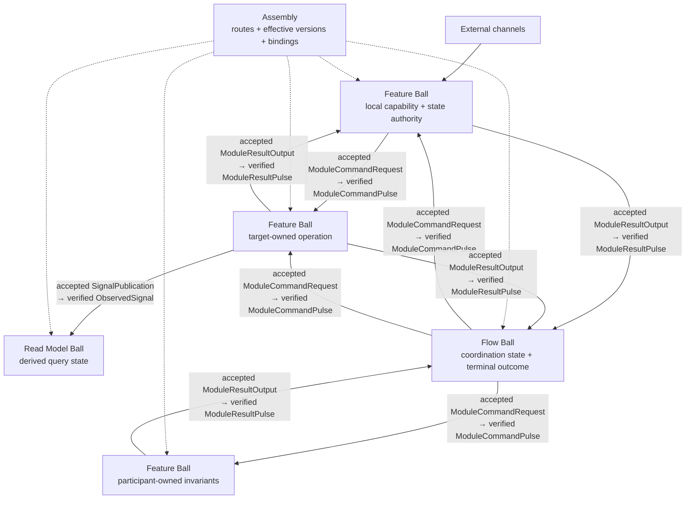

<!-- pkb:translation source="docs/COMPOSITION.md" -->

[Документация на русском](README.md) · [Оригинал на английском](../COMPOSITION.md)

> Русский перевод для чтения. Нормативный источник — [английский Core](../../spec/pokeball-architecture-core.md).

# Композиция в Pokeball

> [!NOTE]
> Это руководство для чтения, а не нормативный документ. Единственный нормативный источник — упорядоченный набор документов Core с точкой входа [`spec/pokeball-architecture-core.md`](spec/pokeball-architecture-core.md). При расхождении с отмеченным исходным положением Core действует Core.

[← Обзор Pokeball](README.md) · [Архитектура](ARCHITECTURE.md) · **Композиция** · [Внедрение](ADOPTION.md) · [Agent Pack](agents/README.md)

Руководство описывает роли в приложении, зависимости между Ball, маршруты команд и результатов, чтения, полномочия над статусом, контекст безопасности и техническую основу Foundation.

Для изменения внутри одного владельца состояния начните с его исходного кода и функции решения. Обращайтесь к этому руководству, когда появляется реальная зависимость или нужно выбрать границу; один вызов вспомогательной функции или новая папка сами по себе не создают Flow. [Быстрый старт](QUICKSTART.md) показывает локальный случай, а [оценка для проекта](EVALUATION.md) помогает измерить, окупается ли более крупное разбиение.

## Как устроена композиция приложения

Pokeball различает четыре роли компонентов приложения:

| Роль | Чем владеет | Чем не владеет |
|---|---|---|
| `Feature Ball` | Локальной бизнес-возможностью и полномочиями над её состоянием | Внутренними деталями или изменяемым состоянием другой функции |
| `Flow Ball` | Жизненным циклом конкретной координации нескольких участников и её конечным исходом | Доменными фактами участников или общим движком рабочих процессов |
| `Read Model Ball` | Производным состоянием для запросов, позициями источников, свежестью и правилом перестроения | Полномочиями команд над исходными фактами |
| Пакет утилит | Чистой технической логикой без состояния | Полномочиями над состоянием, протоколом, жизненным циклом или ресурсами |

**Обозначения стрелок.** Сплошные стрелки показывают направление протокола: принятый выход источника становится проверенным последующим Pulse цели или источника. Пунктир показывает статический выбор маршрута Assembly, действующей версии и привязки; сам по себе он не означает исполнение, бизнес-полномочия или связь `Direct Control Dependency`.

Все семантические зависимости между Ball явны и ограничены. Физические импорты вспомогательного кода остаются в ациклическом графе времени компиляции, но не образуют пятый вид семантической зависимости. У каждой семантической связи есть точная действующая идентичность протокола; явные версии появляются, когда стороны могут версионироваться или развёртываться независимо. `Assembly` объявляет только маршрут, версию и привязку; это не посредник времени исполнения, конструктор данных, классификатор отказов или владелец бизнес-полномочий.

Когда применяется `maxCumulativeFanout`, он один раз учитывает каждую отдельную ветвь от принятого выхода источника к действующему маршруту/потребителю в пределах одной корневой причинной области. Конечные и сходящиеся обходы учитываются, совместно достижимые ветви суммируются, взаимоисключающие варианты используют общее максимальное резервирование, повтор или повторная доставка того же кортежа по тому же маршруту не добавляет единицу, а асинхронная передача сохраняет остаток области. При точном `N+1` всё решение сверх лимита отклоняется до принятия; ни одна часть пакета не отправляется.

**Существенная координация** есть, когда один владелец полномочий должен владеть любым независимым жизненным циклом процесса, семантическим порядком или ветвлением/объединением, компенсацией или восстановлением, отменой, сверкой либо конечным исходом между владельцами полномочий участников. Одного такого свойства достаточно, если оно нарушает условия простого взаимодействия в один переход. Число вызовов, последовательная запись кода или один обмен командой и результатом сами по себе не означают существенную координацию и не требуют `Flow Ball`.

### Чтения, Draining и полномочия над статусом

Межвладельческий `ReadDependency` однозначно определяет одного целевого владельца полномочий, принадлежащее цели отображение `Query -> ResultPayload` и действующую идентичность протокола, целевого владельца чтения/статуса, требование вызывающей стороны к свежести/согласованности, а также маршрут и привязку Assembly. Вызывающая сторона и Assembly не переопределяют результат цели, метку, факт статуса или смысл чтения. Несколько чтений остаются независимыми и не обещают единого атомарного снимка нескольких источников без отдельного объявленного механизма.

`Draining` отклоняет новые логические изменения, но обслуживает каждый доступный объявленный `Query` и запрос статуса из своего зафиксированного источника полномочий. Если источник чтения недоступен, доверенная граница может вернуть существующий ответ проверки или допуска до `read`; после допуска `read(...) -> ReadResult` остаётся успешным и не создаёт Decision.

У каждого пространства имён статуса ровно один зафиксированный источник запросов с ревизиями и одним писателем; он не получает полномочий команд над исходными бизнес-фактами. `OperationId` обозначает принятую корневую операцию: резервирование кандидата до `decide` либо отклонение корневой проверки, допуска или Decision до принятия не создаёт операции, дескриптора, выхода, известной строки статуса или маркера хранения. Зафиксированный снимок, покрывающий нужную область, может вернуть `NotFound`; непринятие нижестоящей целью остаётся аспектом Step уже принятой исходной операции. Совместное размещение может уменьшить отставание и число транзакционных границ; отдельный владелец статуса/Read Model может изолировать нагрузку запросов и объединять объявленные источники, но платит отставанием материализации и подтверждениями позиций источников. Ни один вариант не допускает двух независимо записываемых ответов статуса.

### Безопасность, контекст и Foundation

Когда актор, арендатор, издатель, область доверия, уровень подтверждения или делегирование могут менять `Decision` либо разрешение или выбор результата `Query`/чтения статуса, доверенная граница привязки к среде исполнения строит проверенный, ограниченный контекст с минимальным набором полей. Основа — одобренный издатель либо равноценное фиксированное доверенное доказательство в том же стеке. Поддельное, изменённое, выпущенное не тем издателем или в другой области, отсутствующее, устаревшее либо иначе непроверяемое обязательное доказательство ведёт к закрытому отказу. Решения и чтения, не зависящие от актора, не создают артефактов контекста актора, издателя, аутентификации или доказательств актора.

Только Nucleus Policy Gate принимает бизнес-решение о разрешении на основе зафиксированного State, текущей причины или Query и доверенного контекста. Непосредственно перед исполнением с полномочиями Resource/target Execution Gate проверяет все применимые доказательства, capabilities, ограничения, версии, свежесть/отзыв, конечную точку, квоту и привязку безопасного приёмника, не принимая нового бизнес-решения. Сбой проверки после принятия остаётся объявленным путём Resources, результата или статуса; он не может откатить или понизить статус принятой работы либо стать носителем ответа до принятия.

Общий код Foundation содержит только технические примитивы. Он не владеет изменяемым бизнес-смыслом, решениями бизнес-правил, доменными полномочиями или статусом, выбором маршрутов, локатором сервисов или скрытым состоянием связи. Общая доменная/бизнес-утилита без владельца запрещена: оставьте семантику внутри Ball, в том числе с намеренным небольшим дублированием, либо назначьте одного владельца Ball/Flow и откройте его объявленный Application Surface/протокол.

---

[← Архитектура](ARCHITECTURE.md) · [Обзор Pokeball](README.md) · [Далее: внедрение →](ADOPTION.md)
