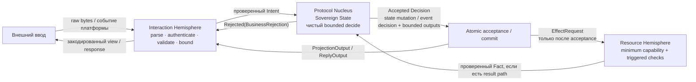
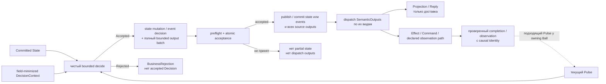
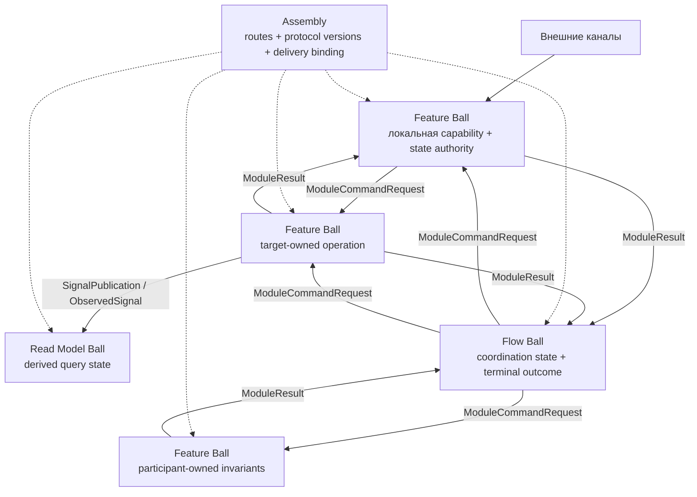

# Pokeball Architecture

> Спецификация архитектуры приложений из явно связанных функциональных модулей, которые владеют своим состоянием, принимают чистые ограниченные решения, общаются через закрытые типизированные протоколы и не обещают гарантий без доказательств.

[Спецификация Core](../../spec/pokeball-architecture-core.md) · [Английская версия](../../README.md) · [Agent Pack](../agents/README.md) · [Как начать](#как-начать) · [Документы](#документы) · [Лицензия](#лицензия-и-авторство)

> [!IMPORTANT]
> [Спецификация Core](../../spec/pokeball-architecture-core.md) — единственный нормативный источник для Pokeball. Эта страница знакомит с архитектурой, а [Agent Pack](../agents/README.md) содержит практические рекомендации на основе Core. При расхождении действует Core.

В репозитории собраны спецификация Core и практические материалы по внедрению. Здесь нет среды выполнения, фреймворка, библиотеки или эталонной реализации Pokeball.

## Какую задачу решает Pokeball

Приложение с состоянием трудно менять, если владельцы данных, внешние действия, асинхронные результаты, права доступа, повторы и гарантии доставки спрятаны в коде. Pokeball делает эти решения явными:

- Кто владеет каждым изменяемым смысловым фактом?
- Какие именно входные данные могут его изменить?
- Какие типизированные результаты могут покинуть модуль и только после какой точки принятия?
- Как асинхронный результат подтверждает связь с породившей его операцией?
- Какие ограничения заданы для очередей, повторов, числа получателей, состояния и объёма работы?
- Какие гарантии следуют из Core, а какие требуют конкретного runtime-профиля и подтверждающих данных?

Для локального профиля `Inline` Pokeball не требует посредника, брокера, очереди, рефлексии, сериализации, runtime-контейнера DI или конкретной базы данных.

## Архитектура одним предложением

`Ball` — минимальная практически применимая граница, внутри которой один владелец решений может обеспечить нужные инварианты, не читая изменяемое состояние другого `Ball`.

Каждый `Ball`:

1. владеет явно заданной областью канонического состояния;
2. отделяет внешний ввод, чистую логику принятия решений и работу с внешними ресурсами;
3. использует только нужные закрытые типизированные пути;
4. атомарно принимает snapshot state mutation или `EventDecision` вместе с полным пакетом `SemanticOutput`;
5. не отправляет ни один `SemanticOutput` до принятия `Decision`;
6. связывает отложенную или отдельно наблюдаемую работу с устойчивой причиной и проверенным происхождением;
7. ограничивает каждую реально переменную величину конечным пределом.

У Pokeball один Core, а не отдельные Lite- и full-версии. Общие инварианты действуют всегда. Достижимый путь или известный риск включает только связанную защиту; заявленная гарантия — нужные доказательства. Защиту задают один раз: самой конструкцией, локально или точной неизменяемой ссылкой на policy проекта, профиля, Assembly либо binding. В `Ball` остаются лишь разрешённые отличия. Если условие точно не выполняется, не нужны пустая таблица, ноль, `N/A` или пустой набор доказательств.

`Ball` не обязан совпадать с экраном, конечной точкой API, таблицей, репозиторием, сервисом, агрегатом или сценарием использования. Вспомогательный компонент без состояния остаётся утилитой; одного межмодульного вызова недостаточно, чтобы выделять `Flow`.

## Один Ball крупным планом



Это логические роли; им не обязательно соответствовать отдельным процессам, классам или объектам в памяти.

- **Interaction Hemisphere** разбирает, проверяет, ограничивает и кодирует данные канала; actor/origin аутентифицируется, только если эта identity влияет на решение. Она не меняет каноническое состояние и не создаёт прикладных эффектов.
- **Protocol Nucleus** владеет каноническим состоянием `Ball` (`SovereignState`) и единолично принимает локальные прикладные решения. Он не выполняет I/O и не читает ambient clock, random source, environment, service locator или platform SDK.
- **Resource Hemisphere** выполняет существующий типизированный `Effect` через minimum capability. Safe sink добавляется только на interpreter edge, а ответ проверяется и преобразуется в `Fact` только на result-producing path; сама Hemisphere не принимает прикладных решений.

Схема показывает цикл изменения состояния с обращением к внешнему ресурсу. `Query` не меняет состояние и не создаёт `Decision` или `SemanticOutput`. `ConsistencyStamp` нужен, когда чтение пересекает границу authority или времени, кэшируется, сравнивается, подтверждает status, объединяет источники либо заявляет consistency; локальному getter в одном call scope достаточно идентичности текущего снимка.

## Модель Decision и acceptance

Канонический переход в snapshot-режиме выглядит так:

```text
decide(
    state: State,
    pulse: Pulse,
    context: DecisionContext
) -> Accepted(Decision { nextState, boundedOutputs })
   | Rejected(BusinessRejection)
```

`Pulse` — закрытое объединение `Intent`, `Fact`, `ModuleResult`, `ObservedSignal` и объявленных trusted-вариантов `ControlPulse`. В snapshot-режиме успешный `Decision` содержит новое состояние и полный упорядоченный пакет канонических оболочек `SemanticOutput`:

```text
ProjectionOutput | ReplyOutput | EffectRequest
ModuleCommandRequest | SignalPublication | TimerRequest
```

В форме `EventJournal` вариант `Accepted(EventDecision)` содержит `EventMutation { events, outputs }` или `NoDomainChange { outputs }`; отдельный `nextState` не возвращается. Общее правило одно: snapshot state mutation или event decision принимается атомарно вместе с полным пакетом исходящих outputs.



Если есть outputs, порядок строгий: **сперва acceptance или commit, затем dispatch**. Сбой до acceptance не может сделать видимым частично изменённое состояние или часть принятого пакета. Если существует fallible delivery path, сбой после acceptance не откатывает `Decision`, а включает только применимый контракт retention, retry, status или `OutcomeUnknown`.

Только `SemanticOutput`, для которого объявлен путь получения результата или наблюдения, может позднее породить подходящий `Pulse` у исходного или объявленного consumer. `ProjectionOutput` и `ReplyOutput` — пути доставки, а не скрытые result Pulses.

## Как складывается приложение

Pokeball выделяет четыре роли прикладных компонентов:

| Роль | Чем владеет | Чем не владеет |
|---|---|---|
| `Feature Ball` | Локальной прикладной возможностью и её состоянием | Внутренним устройством или изменяемым состоянием другого Feature |
| `Flow Ball` | Состоянием конкретного процесса с несколькими участниками и его итогом | Фактами предметной области участников или глобальным workflow engine |
| `Read Model Ball` | Производным состоянием для запросов, позициями источников, актуальностью и правилами rebuild | Правом принимать команды от имени исходных фактов |
| Utility package | Чистой логикой без состояния | Состоянием, протоколом, жизненным циклом или доступом к ресурсам |



Все связи между `Ball` объявляются явно и имеют конечные пределы. У каждой есть точная effective protocol identity; явные версии нужны, когда endpoints версионируются или развёртываются независимо. `Assembly` описывает маршруты и правила доставки, но не служит runtime-посредником и не принимает прикладных решений. `Flow Ball` нужен, когда у координации есть значимые свойства: своё состояние или жизненный цикл, порядок шагов, compensation, reconciliation, deadlines, cancellation, ручное вмешательство или собственный terminal outcome.

## Правила Core, которые нельзя нарушать

В Core есть 43 канонических закона. Таблица помогает найти нужную группу, но не заменяет точный текст. Это не означает 43 локальных артефакта: §20.1 задаёт для каждого закона класс применимости, точный триггер, владельца декларации, владельца enforcement или evidence и правило повторного использования.

| Область | Правило для разработчика | Законы |
|---|---|---|
| Граница и решение | Логически разделяйте Interaction, Nucleus и Resources. Nucleus должен быть чистым, явным и bounded; только он создаёт semantic actions. Протоколы закрыты. | `PBA-01–06` |
| Acceptance и сбои | Атомарно принимайте состояние и весь пакет outputs, отправляйте его лишь после этого, не допускайте reentrant transition и partial acceptance. | `PBA-07–10` |
| Состояние и identity | У каждого изменяемого факта один authority и writer; виды состояния не смешиваются; отложенная или отдельно наблюдаемая работа получает stable semantic identity. | `PBA-11–18` |
| Асинхронность и доставка | Если такие пути есть, разделяйте ACK/result и моделируйте ambiguity, idempotency, cancellation races и retry ownership. | `PBA-19–24` |
| Композиция | Для реальных связей между `Ball` и процессов с состоянием объявляйте dependencies/owners и ограничивайте routes и fan-out. | `PBA-25–30` |
| Безопасность и ресурсы | Применяйте quarantine, capabilities, gates, safe sinks и secret/unsafe controls только на существующих границах и рисках; ambient authority запрещён всегда. | `PBA-31–37` |
| Цена и гарантии | Каждая реально переменная величина конечна; точные policies используются повторно; evidence нужен только для конкретного claim. | `PBA-38–43` |

Точные законы находятся в [§20 Core](../../spec/pokeball-architecture-core.md#20-canonical-pokeball-laws), а рабочий checklist — в [§18 Core](../../spec/pokeball-architecture-core.md#18-practical-checklist).

## Профили: платим только за нужные гарантии

Профили — независимые измерения. Любая комбинация сохраняет общие инварианты Core и не может отменить защиту, включённую реальным путём, риском или заявленной гарантией.

Проект или binding может один раз выбрать точную profile policy по умолчанию; в `Ball` записывают только разрешённое отличие.

| Измерение | Варианты | Что меняется |
|---|---|---|
| Execution | `Inline` / `BoundedConcurrent` | Прямое выполнение до завершения или ограниченная очередь и workers при одном writer |
| State | `Transient` / `SnapshotOutbox` / `EventJournal` | Жизнь только в памяти процесса, durable source records или журнал событий |
| Isolation | `InProcess` / `Isolated` | Логическая граница в одном процессе или изоляция в process/sandbox с bounded IPC |
| Security | `Standard` / `Hardened` | Базовые правила или строгие требования к actor, grant, capability, secrets и защите от resource abuse |
| Composition | `Static` | Явный compile-time или generated wiring без обязательного runtime registry |

Стартовые варианты из Core:

- Локальная state machine интерфейса: `Inline + Transient + InProcess + Standard`.
- Асинхронная mobile feature: `BoundedConcurrent + Transient/SnapshotOutbox + InProcess`.
- Durable backend aggregate: `BoundedConcurrent + SnapshotOutbox + InProcess + Hardened`.
- Недоверенный plugin или parser: `BoundedConcurrent + Transient/SnapshotOutbox + Isolated + Hardened`.

## Границы гарантий

Pokeball явно описывает границы гарантий, но само название профиля ничего не доказывает:

- Если внешнее действие могло выполниться, timeout не доказывает ошибку или отсутствие действия: нужен `OutcomeUnknown` и путь reconciliation.
- Если поддерживается semantic cancellation, это протокол и race, а не мгновенная физическая остановка.
- Для реализации, соответствующей Core и имеющей подтверждающие данные, гарантия профиля `SnapshotOutbox` заканчивается на durable source acceptance и хранении исходящего output/status в заявленных пределах. Профиль сам по себе не доказывает target receipt, target acceptance, business success, exactly-once execution или безусловную eventual delivery.
- `Flow Ball` координирует участников, но не создаёт distributed ACID transaction. Compensation — новое действие, которое тоже может завершиться ошибкой, а не откат времени.
- Чтение из нескольких источников не считается atomic snapshot без механизма, который это обеспечивает.
- Заявления `Hardened`, performance, zero-allocation, durability и security требуют evidence для конкретного binding и его threat/failure model.

Более сильные протоколы для durable runtime, distributed delivery, full replay, secure isolation, subscriptions, conformance и dynamic extensions оставлены будущим extension specifications.

## Как может выглядеть проект

Физические папки не нормативны, но Core советует раскладку, где видны зависимости:

```text
features/
  catalog/
    interaction/
    nucleus/
      protocol/
      state/
      transition/
      policy/
    resources/
    ball.yaml            # optional/generated resolved view

flows/
  checkout/
    interaction/
    nucleus/
      protocol/
      state/
      transition/
    ball.yaml            # optional/generated resolved view

application/
  assembly/
  runtime/
  observability/

foundation/
  bounded/
  security/
  time/
  tracing/
```

`ball.yaml` необязателен: источником истины может быть typed source, а инструмент при необходимости создаст полный resolved view для deployment, review или conformance claim.

Важны не названия папок, а направление полномочий и зависимостей. Interaction связывает внешние каналы с протоколом, Resources — с внешними системами, Nucleus зависит только от собственного состояния, протокола и mechanical foundation, а Assembly — только от публичных протоколов и явных routes. Внутреннее устройство и изменяемое состояние одного Feature не становятся зависимостью другого.

## Как начать

Начните с одного вертикального среза, а не перестраивайте сразу всё приложение:

1. Назначьте один authority каждому изменяемому смысловому факту.
2. Выберите границу `Ball`; материализуйте `StateKey`, только если возможны несколько instances или identity выходит за пределы call scope.
3. Опишите только используемые закрытые inputs, state и outputs.
4. Напишите чистую bounded-функцию `decide` до выбора framework или DSL.
5. Перечислите достижимые пути, риски, выбранные профили и будущие claims.
6. Разрешите каждую применимую защиту один раз: конструкцией, локальной декларацией или точной project/binding policy с разрешённым delta.
7. Добавляйте adapters, revisions, handles, stale-result, retry, cancellation, status, security и durability при первом срабатывании их триггера.
8. Проверяйте базовую семантику, включённые пути и локальные отличия; общий механизм тестируйте один раз в его scope.
9. Добавляйте dependencies и Assembly routes только для реальных связей между `Ball`.
10. Создавайте evidence только для заявленных claims; полный resolved contract view нужен лишь для deployment или conformance review.

Если вы внедряете Pokeball с помощью агентов, начните с [Agent Pack](../agents/README.md). Для обычного design не нужен полностью заполненный overlay. [Инструкция по установке](../agents/INSTALL.md) объясняет, как выбрать точные reusable policies и записать delta для `Ball`; принятый resolved project contract и evidence обязательны только перед conformance claim.

## Документы

### С чего начать

- **Понять архитектуру:** прочитайте этот обзор, затем §§0–3 Core об области и семантике и §§4–10 о границах, состоянии, протоколах и композиции.
- **Посмотреть полные сценарии:** разберите примеры Catalog и Checkout в §§15–16 Core.
- **Применить Pokeball:** используйте [Agent Pack](../agents/README.md) при проектировании и проверке, а при переносе в другой репозиторий следуйте [инструкции по установке](../agents/INSTALL.md).

### Порядок чтения Core

1. §§0–3 — область, цели, identities и decision model.
2. §§4–10 — границы `Ball`, протоколы, состояние, acceptance, async semantics и композиция.
3. §12 — выбор профилей.
4. §§15–16 — примеры Catalog и Checkout.
5. §§18–20 — checklist, anti-patterns и канонические законы.
6. §§11, 13, 14, 17, 21 и 22 — безопасность, пределы, manifests, tests, внедрение и glossary.

### Основные документы

| Документ | Что в нём находится |
|---|---|
| [Спецификация Core](../../spec/pokeball-architecture-core.md) | Полная спецификация Core, примеры, законы, checklist и glossary |
| [Agent Pack](../agents/README.md) | Практические рекомендации и runbooks на основе Core для применения Pokeball в другом проекте |
| [Английский обзор](../../README.md) | Англоязычная версия этой страницы |
| [Лицензия](../../LICENSE) и [уведомление](../../NOTICE.md) | Условия лицензии, авторство, область действия и рекомендуемая атрибуция |

## Лицензия и авторство

Copyright © 2026 **Владислав Томилов (4wl2d)**. `4wl2d` — его публичный
псевдоним.
Оригинальные спецификация, документация, схемы, примеры и Agent Pack
доступны по лицензии
[Creative Commons Attribution 4.0 International](https://creativecommons.org/licenses/by/4.0/deed.ru)
(`CC-BY-4.0`). Их можно копировать и менять для любых целей, в том числе
коммерческих. При публикации нужно сохранить сведения об авторе и уведомления
об авторском праве, лицензии и отказе от гарантий; приложить текст лицензии или
ссылку на него; по мере возможности дать ссылку на исходный материал; описать
свои правки и не удалять прежние отметки об изменениях. ShareAlike не требуется.

Лицензия охватывает текст и схемы Pokeball Architecture, но не создаёт
исключительного авторского права на идеи, методы, системы и принципы работы.
CC BY 4.0 не даёт патентных прав и прав на товарные знаки. Что именно покрывает
лицензия и как указать автора, описано в [`NOTICE.md`](../../NOTICE.md). Полный
юридический текст находится в [`LICENSE`](../../LICENSE).
