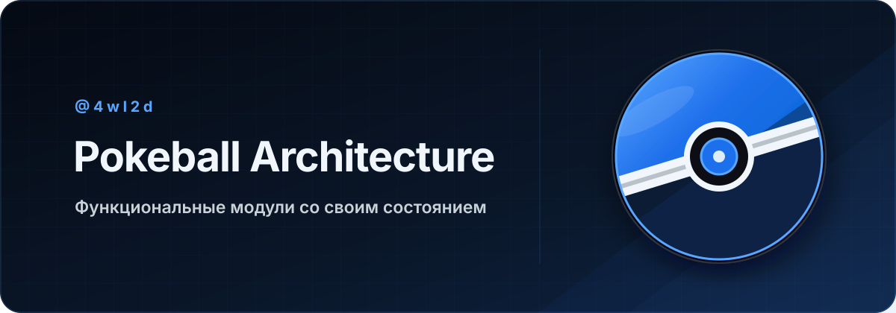

<!-- pkb:translation source="README.md" -->

[Документация на русском](README.md) · [Оригинал на английском](../../README.md)

> Русский перевод для чтения. Нормативный источник — [английский Core](../../spec/pokeball-architecture-core.md).

<h1 align="center">Pokeball</h1>

  

  <strong>Функциональные модули с собственным состоянием, чистыми решениями и явными внешними действиями.</strong>

  <a href="QUICKSTART.md">Написать первый модуль</a> ·
  <a href="EVALUATION.md">Оценить пользу и затраты</a> ·
  <a href="SKILLS.md">Скиллы для агентов</a> ·
  <a href="spec/pokeball-architecture-core.md">Core на русском</a> ·
  <a href="../../README.md">English</a>

Pokeball — спецификация архитектуры приложений с состоянием. Функциональный модуль приложения владеет своим состоянием, принимает решения в чистой функции и выполняет внешние действия только после принятия решения. Начать можно с одного исходного файла с обычными типами и функциями.

**Начните с [практического руководства для разработчика](QUICKSTART.md).** В нём целиком показаны локальная функция, её тесты и изменение бизнес-правила, а затем вводится асинхронная работа. Чтобы внести обычное изменение в проекте с уже настроенной привязкой к среде исполнения (binding), не нужно сначала изучать весь справочник.

## Зачем его использовать?

Представьте поиск: сначала запущен запрос A, затем B, но ответ A приходит последним. Или платёж: время ожидания истекло, хотя провайдер уже мог списать деньги. Одни лишь слои и направление зависимостей не определяют, как приложение обработает эти ситуации.

Pokeball предлагает команде явные контракты для повторяющихся вопросов:

- **Владение состоянием:** у каждого изменяемого факта один владелец полномочий и один логический исполнитель изменений.
- **Решения и последствия:** решение опирается на State и явные текущие входные данные и контекст; State принимается вместе со всеми предусмотренными выходами; отправка начинается после принятия.
- **Асинхронная работа:** результаты связаны с принятыми причинами; устаревшие результаты отклоняются или обрабатываются по выбранной политике; истечение времени ожидания отличается от подтверждённого сбоя.
- **Ограниченный объём работы:** для реально переменных величин задаются конечные пределы, а для более сильных гарантий указываются подтверждающие данные.

Эти контракты могут сделать ревью и обработку сбоев более последовательными. За них приходится платить проектированием, кодом, тестами и обучением. [Сравнение пользы и пилотное внедрение](EVALUATION.md) объясняет, как измерить обе стороны.

Хорошая Clean Architecture может использовать те же механизмы. Чистые функции, изолированные тесты и заменяемые адаптеры — общие преимущества; дополнительная ценность Pokeball — единый явный контракт поведения при работе с состоянием. Если в проекте уже есть равноценные правила и проверки, новая терминология может мало что добавить.

## Какой код я пишу?

| Обычный код | Термин Pokeball | Ответственность |
|---|---|---|
| Функциональный модуль с собственным состоянием | Ball | Владеть фактом, его инвариантом и жизненным циклом. |
| Адаптер ввода | Interaction | Проверять и адаптировать используемый канал ввода; оставлять бизнес-выбор в функции решения. |
| Чистые функции решения и чтения | Nucleus | Вычислять предлагаемое изменение или результат чтения из явных значений. |
| Адаптер внешнего действия | Resources | Выполнять только принятую запрошенную работу через необходимую границу. |

Привязка к среде исполнения связывает эти роли и обеспечивает единственного исполнителя изменений, принятие решений и применимые правила выполнения. Небольшой проект может реализовать его напрямую, а проект с готовым механизмом — использовать его повторно. Это реальная работа по интеграции; спецификация не выполняет её за проект.

У локальной функции, которая меняет только состояние, роль Resources пуста. Три логические роли не требуют трёх классов, папок, интерфейсов или шины сообщений. Карта ролей может быть видна из типов, вызовов, мест проверки и единственного места публикации принятого изменения; отдельный документ не нужен, если эти факты уже можно проверить.

## Сколько механизмов потребуется?

Core один. Безусловные инварианты продолжают действовать; дополнительные механизмы появляются, когда их требует реальный путь, риск или заявленная гарантия.

| Ситуация | С чего начать |
|---|---|
| Локальное состояние и синхронные вызовы | Собственный State, закрытый типизированный ввод, чистое решение, последовательная атомарная публикация и соответствующие тесты. |
| Внешняя работа, продолжающаяся после завершения инициирующего вызова | Принятые выходы, проверенная связь результата с причиной, ограниченное выполнение и обязательный контракт статуса операции. |
| Принятая работа должна пережить потерю процесса | Конкретная привязка к среде исполнения с долговечным хранением, тесты сбоев и восстановления, явная обработка исходов внешних действий. |
| Нескольким владельцам полномочий нужен независимый рабочий процесс | Владелец Flow для реальной координации и итогового исхода. |

Не нужны отдельный манифест, пустая категория протокола, неиспользуемый адаптер, DI-контейнер времени выполнения или копия неизменившейся общей политики в каждой функции приложения. Действующая обязанность по-прежнему требует реального механизма. Изучайте детали по мере появления соответствующей задачи через [внедрение](ADOPTION.md), [композицию](COMPOSITION.md) и [повседневный рабочий процесс в Core](spec/core/reference/21-adoption.md#217-everyday-development-and-production-responsibility).

## Подходит ли это для продакшена?

Готовность к продакшену относится к реализованной системе, её конкретной привязке к среде исполнения, нагрузке и гарантиям. Репозиторий содержит спецификацию, учебные примеры и маршруты проверки; здесь нет среды выполнения, библиотеки, эталонной реализации, сравнительного бенчмарка или подтверждающих данных для вашего развёртывания. Версия и статус совместимости указаны в [заголовке Core](spec/pokeball-architecture-core.md).

На одном реальном вертикальном срезе проверьте поведение при сбоях, стоимость реализации и первое изменение, которое внесёт человек. Учтите общие затраты на настройку и сопровождение. Продолжайте, если польза подтверждена и укладывается в ваш бюджет; измените подход или остановитесь, если существующее решение проще удовлетворяет тем же требованиям. Для механики без состояния и пассивных путей, которым не нужен модуль с собственным состоянием и решениями, используйте обычные утилиты или адаптеры. Pokeball не обещает преимуществ в каждом проекте.

Следуйте [руководству по оценке проекта и проверке готовности к продакшену](EVALUATION.md). Согласованность документации и прохождение сценариев агентами не доказывают удобство для людей или надёжность в продакшене.

## Скиллы для агентов

[Официальные скиллы](SKILLS.md) дают ИИ-агенту практические инструкции для работы с Pokeball. Начните с `pokeball` для обычных изменений функциональности; подключайте `pokeball-async`, `pokeball-composition`, `pokeball-binding` или `pokeball-review` для соответствующих задач. Каждый скилл устанавливается независимо и содержит краткие рабочие инструкции и проверки для своей задачи в одном `SKILL.md`. Агент применяет их непосредственно к коду и тестам проекта; канонический Core сохраняет приоритет.

[Установите скиллы одним промптом](agents/INSTALL.md#install-skills-with-your-agent) через своего ИИ-агента или следуйте [ручному руководству установки из GitHub](SKILLS.md#download-once). Копируйте только нужные каталоги скиллов целиком. Установленные скиллы работают без локальной копии репозитория Pokeball и без доступа к сети. Ручное руководство также описывает отдельное обновление из GitHub. Скиллы задают рабочие процедуры для написания кода; [Agent Pack](agents/README.md) содержит более широкий контракт, руководства и проверки ревью. Ни один из этих наборов не предоставляет среду исполнения приложения и не подтверждает соответствие Core. При изменении скилла или его источника следуйте [руководству по созданию скиллов](SKILL-AUTHORING.md).

Документация для людей — описание скиллов, установка, обновление, сопровождение, Core и Agent Pack — доступна на русском. Рабочие `SKILL.md`, идентификаторы протоколов и исполняемые команды сохраняют исходную форму; русские пояснения не создают второй набор скиллов или отдельную архитектуру.

## Документы

| Что вы хотите сделать | Документ |
|---|---|
| Написать и изменить небольшую функцию приложения | [Практическое руководство для разработчика](QUICKSTART.md) |
| Сравнить пользу, затраты и применимость в продакшене | [Оценка проекта](EVALUATION.md) |
| Выбрать профили и внедрять постепенно | [Руководство по внедрению](ADOPTION.md) |
| Понять решения и логические роли | [Руководство по архитектуре](ARCHITECTURE.md) |
| Выбрать границы, зависимости и владельца Flow | [Руководство по композиции](COMPOSITION.md) |
| Уточнить конкретное правило или провести аудит архитектуры | [Спецификация Core](spec/pokeball-architecture-core.md) |
| Дать агенту инструкции для конкретных задач разработки | [Скиллы, установка и обновления](SKILLS.md) |
| Написать или изменить скилл | [Создание и сопровождение скиллов](SKILL-AUTHORING.md) |
| Применить полный агентский контракт в другом репозитории | [Agent Pack](agents/README.md) и [установка](agents/INSTALL.md) |
| Прочитать обзор на английском | [Английский обзор](../../README.md) |

Точка входа Core и документы его упорядоченного манифеста образуют каноническую спецификацию. Каждый помеченный исходный фрагмент определяет свой закон; руководства, примеры, индексы законов и Agent Pack — производные представления. Если представление расходится с исходным фрагментом, действует Core. Обычная работа затрагивает соответствующие источники и тесты; полный аудит по-прежнему охватывает каждый уникальный источник.

## Лицензия и авторство

Copyright © 2026 **Vladislav Tomilov (4wl2d)**. `4wl2d` — его публичный
псевдоним.
Оригинальные спецификация, документация, схемы, примеры и Agent Pack
доступны по лицензии
[Creative Commons Attribution 4.0 International](https://creativecommons.org/licenses/by/4.0/)
(`CC-BY-4.0`). Их можно копировать и менять для любых целей, в том числе
коммерческих. По CC BY 4.0 при публикации нужно сохранить сведения об авторе и уведомления
об авторском праве, лицензии и отказе от гарантий; приложить текст лицензии или
ссылку на него; по мере возможности дать ссылку на исходный материал; описать
свои правки и не удалять прежние отметки об изменениях. ShareAlike не требуется.

Лицензия охватывает текст и схемы Pokeball Architecture, но не создаёт
исключительного авторского права на идеи, методы, системы и принципы работы.
CC BY 4.0 не даёт патентных прав и прав на товарные знаки. Что именно покрывает
лицензия и как указать автора, описано в [`NOTICE.md`](NOTICE.md). Полный
юридический текст доступен [на русском](LICENSE.md) и в исходном [`LICENSE`](../../LICENSE).
