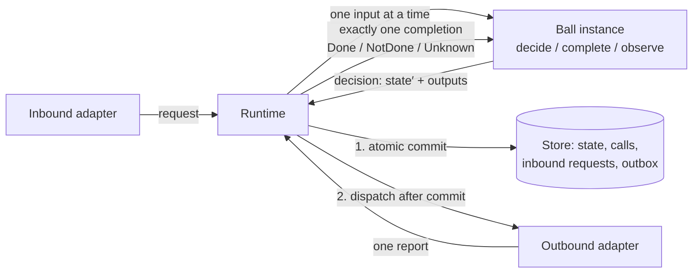
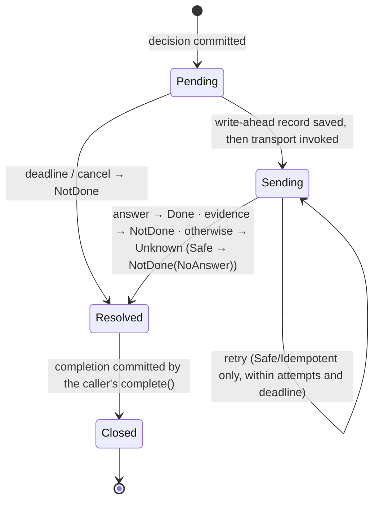

# Pokeball Core 2.0 — Specification

| | |
|---|---|
| **Version** | `2.0.0-draft.1` |
| **Status** | Draft for review. Normative sections may change before `2.0.0`. |
| **Date** | 2026-09-27 |
| **Supersedes** | Core `1.5.0-draft` ([previous published version](https://github.com/4wl2d/Pokeball/tree/1bb9e0ecca4d4d1c8b39327c93988c1b490f303e)); mapping in [`docs/migration-from-1.5.md`](../docs/migration-from-1.5.md) |
| **Reference implementation** | [`reference/kotlin/`](../reference/kotlin/) (Kotlin/JVM) |
| **Formal model** | [`formal/alloy/obligations.als`](../formal/alloy/obligations.als) |

## 0. How to read this document

Sections 2–7 are **normative**. Section 8 is **guidance**: recommended practice that a conforming system may ignore with reason. Section 9 defines **conformance**. Everything else, and every example, is informative.

The key words MUST, MUST NOT, SHOULD, SHOULD NOT and MAY are to be interpreted as described in RFC 2119 and RFC 8174 when, and only when, they appear in capitals.

Each rule names its **enforcement**: the mechanism that checks it. Rules marked *runtime* bind implementers of a runtime; rules marked *author* bind people who write Balls. "Checked by" lists what this repository provides; "review" means no mechanism is provided and the rule depends on human judgement.

## 1. Scope

Pokeball Core specifies how an application's **stateful components** decide, change their state, and interact with each other and with external systems, such that the following hold by construction:

1. every piece of mutable state has exactly one owner, which changes it only by committing its own decisions;
2. no external effect is requested before the decision that requests it is committed;
3. every outbound request ends in exactly one terminal outcome, and that outcome never claims that nothing happened when something may have happened;
4. a crash never splits a decision: its state change and its requested effects are committed together or not at all.

The same rules apply to an in-memory UI component and to a durable backend component; only the profile (§6) differs.

**Non-goals.** Pokeball Core does not specify: distributed consensus or replication of a Ball across nodes; exactly-once execution of external effects (only idempotency and reconciliation mechanisms that make at-most-once or effectively-once achievable); multi-Ball transactions; a wire format; a UI toolkit; security isolation between Balls in one process; or a deployment topology.

**Applicability.** The architecture targets components with state that matters and asynchronous or fallible interaction with other components or external systems. For stateless transformations and simple CRUD forms without external effects it adds structure without adding protection (see the measured overhead in §10); use plain code there.

## 2. Model

| Term | Definition | Standard analogue |
|---|---|---|
| **Ball** | A single-writer owner of state, addressed by a `BallId` = (type, key). A Ball *type* is defined by a decider; an *instance* by its key. | aggregate (DDD), actor, entity, grain (Orleans) |
| **Decider** | The pure functions of a Ball type: `initial(key)`, `decide(state, request, ctx)`, `complete(state, completion, ctx)`, `observe(state, notice, ctx)`. | Decider (Chassaing), reducer, Elm `update` |
| **Runtime** | Executes Balls: serialises their inputs, invokes deciders, commits decisions, dispatches outputs, tracks obligations. | actor runtime, effect interpreter, "imperative shell" |
| **Port** | A typed request/response contract with an **effect class**, owned by its destination. An *adapter port* is implemented by an adapter; a *Ball port* is served by another Ball. | port (Ports and Adapters) |
| **Adapter** | Code outside every decider that performs requests on an adapter port (outbound) or turns external input into requests (inbound). | adapter (Ports and Adapters), gateway |
| **Effect class** | `Safe` (no effect), `Idempotent` (repeats are deduplicated by the destination), `NonIdempotent` (each delivery may take effect). | RFC 9110 safe and idempotent methods |
| **Composition root** | The one place that lists Ball types, binds adapters to ports, and declares subscriptions. | composition root (dependency injection) |
| **Profile** | What survives a crash: `Transient` or `Durable`. | — |



**Legend.** Boxes are components; arrows are the order of operations in one step (§3.1). Deciders never touch the store or adapters; only the runtime does.

### 2.1 Messages

**Inputs** (what a decider receives):

| Input | Meaning | Decider function |
|---|---|---|
| **Request** | Asks the Ball to do something. May be rejected. | `decide` |
| **Completion** | The single terminal outcome of a call this instance made. Cannot be rejected. | `complete` |
| **Notice** | A publication from a subscribed topic. | `observe` |

**Outputs** (what a decision asks the runtime to do after committing it):

| Output | Meaning |
|---|---|
| **Call**(key, port, request, timeout[, target]) | Ask a port to perform a request. Opens an *obligation*. |
| **Reply**(requestId, value) | Answer an earlier accepted request whose reply was deferred. |
| **Publish**(topic, payload) | Publish a notice to the subscribers declared for the topic. |
| **Cancel**(key) | Ask to cancel an open call. |

A `decide` returns **Accept**(state, reply plan, outputs) or **Reject**(reason). The reply plan is *now* (a value) or *later* (a `Reply` output in a later decision). `complete` and `observe` return **Step**(state, outputs).

### 2.2 Outcomes

Every call and every external request ends in exactly one **Outcome**:

| Outcome | Asserts |
|---|---|
| **Done**(value) | The destination processed the request and answered `value`. `value` may itself describe a business refusal that the destination recorded. |
| **NotDone**(reason) | There is evidence that the request had no effect. |
| **Unknown**(reason) | The request may or may not have taken effect. |

A Ball's reply type describes both results and refusals. `Reject(reason)` reaches the caller as `NotDone(Refused(reason))`; `Accept(…, reply)` reaches it as `Done(reply)`.

### 2.3 Context

A decider receives a **context** supplied by the runtime: the instance's `BallId`, the current time (`now`), the revision the decision will commit as, a deterministic generator of call keys, and, for requests, the request identity and the caller (another Ball, or an external principal authenticated by an inbound adapter).

### 2.4 Time

A decider reads time only from the context and waits only by calling the built-in **timer port** `pokeball.timer` (Safe), which every conforming runtime binds. A timer call is made with `Timer.after(key, delay)`; its *due time* is the commit time plus `delay`, and its deadline is the due time plus a fixed margin (1 s in the reference implementation). A timer:

- completes `Done` at its due time, and never before it unless cancelled;
- cancelled before it fires, completes `NotDone(NotApplied)`; cancelled while still `Pending`, `NotDone(Cancelled)`;
- under the Durable profile, survives a restart: it is re-armed to its original due time, or completes `NotDone(NoAnswer)` if the restart comes after its deadline.

A completion of a timer is a wake-up, not a fact about the world: a decider that must not act before some time SHOULD keep that time in its state and compare it with `now`.

## 3. Execution semantics

This section defines the observable behaviour of a conforming runtime. A runtime MAY implement it differently if no observer (decider, adapter, requester, or durable store after a crash) can tell the difference.

### 3.1 The instance step

Each Ball instance has an inbox. The runtime repeatedly takes one input from one instance and performs one **step**:

```text
1. input  ← dequeue(instance.inbox)
2. result ← decider function for the input kind (state, input, context)
3. check  ← preflight(result)            # §3.5: bounds, keys, replies, bound ports
4. if the result is Reject, a failed check, or a decider fault:
       commit nothing; answer a request with NotDone(…); a faulty completion/notice quarantines the instance
   else:
       commit(state′, new calls as Pending, replies, notices)   # one atomic write
5. dispatch: deliver replies, publish notices, start pending calls   # only after 4 succeeded
```

Steps of one instance never overlap or nest. Steps of different instances MAY run concurrently if every rule in §5 still holds per instance.

### 3.2 Call lifecycle

A call is identified by `(caller BallId, key)`. Its lifecycle is:



**Legend.** Arrows are runtime transitions of one call. `Pending` and `Sending` are durable phases under the Durable profile; `Resolved` is the runtime's choice of outcome, not yet seen by the decider; `Closed` means the caller committed the completion.

Classification when a call resolves:

| Situation | Safe | Idempotent | NonIdempotent |
|---|---|---|---|
| Destination answered | Done | Done | Done |
| Deadline or cancel while `Pending` (never sent) | NotDone | NotDone | NotDone |
| Adapter reports evidence of non-application, single attempt | NotDone | NotDone | NotDone |
| Same, after more than one attempt | NotDone | retry or Unknown | (not retried) |
| No answer; retries left and time left | retry | retry | Unknown |
| No answer; no retries or no time left | NotDone(NoAnswer) | Unknown | Unknown |
| Durable restart while `Sending` | re-send or NotDone | re-send or Unknown | Unknown |
| Durable restart while `Pending` | send | send | send |

A report that arrives after a call resolved is dropped. The information it carries is not lost to the application only if the application asks again (§8.4).

### 3.3 Inbound request lifecycle

At the receiving instance, a request:

1. is **withdrawn** with `NotDone(DeadlineBeforeSend)` if its deadline passes before it is decided;
2. is **refused** with `NotDone(Refused(reason))`, `NotDone(Overloaded)` or `NotDone(Fault)` if the decider rejects it, a bound is reached, or the decider fails; nothing is committed;
3. is **accepted** otherwise: the reply is delivered as `Done(value)` after the commit, immediately or by a later `Reply` output.

A repeated request with the same request identity is not decided again: it joins the open request, or receives the stored reply, within the retention bound (§3.5). External requests obtain a request identity from an idempotency key; a repeat with the same key and a different message is refused with `NotDone(IdempotencyConflict)`.

### 3.4 Ball-to-Ball calls

A call on a Ball port is delivered as a request to the target instance, with the call identity as its request identity. The target's answer becomes the caller's completion. Because the target deduplicates by request identity, Ball ports are Idempotent and a durable runtime re-sends them after a restart. A Ball never waits synchronously for another Ball.

### 3.5 Bounds and preflight

A runtime MUST enforce finite bounds on at least: inbox length per instance, open calls per instance, outputs per decision, call timeout, attempts per call, unacknowledged notices per publisher, and retained answered requests per instance. Before committing, it MUST reject a decision that:

- reuses the key of an open call, or cancels a call that is not open;
- calls a port that the composition root does not bind;
- replies to a request that is not open, or twice to the same request;
- makes a timer call other than through `Timer.after` (§2.4);
- exceeds a bound.

Exceeding a bound while deciding a *request* refuses the request (`NotDone(Overloaded)`); any other failed check, or any failure while deciding a completion or notice, quarantines the instance, because obligations it already holds cannot be refused.

### 3.6 Notices

A published notice is committed with the publishing decision and delivered to every subscriber instance selected by the composition root. A subscriber applies notices from one publisher in publication order and at most once. Under the Durable profile, undelivered notices survive restarts and are redelivered.

### 3.7 Crash and recovery

A **crash** stops the runtime abruptly. Under the **Transient** profile, all state, open calls and open requests of the runtime are lost. Under the **Durable** profile, the runtime restarts from the committed records: committed state, open calls with their phases, open and recently answered requests, unacknowledged notices. It then applies the restart rows of the table in §3.2, reschedules deadlines, and redelivers notices.

## 4. Formal core

The protocol of §3.2 (commit, write-ahead, send, retry, deadline, crash, recovery, lossy and duplicating network) is modelled in Alloy 6 in [`formal/alloy/obligations.als`](../formal/alloy/obligations.als). For the correct protocol, no counterexample to the following exists within the stated bounds (3 calls, traces of up to 14 steps; L1: 2 calls, 12 steps), and each of six seeded runtime bugs yields one ([run the bounded checks](../docs/reproducibility.md#alloy-model)):

| Property | Statement |
|---|---|
| P1 NoSendBeforeCommit | A request is sent only for a call whose decision is committed. |
| P2 OutcomeStable | A call's terminal outcome never changes. |
| P3 NoFalseNotDone | If a call of an effectful port completes `NotDone`, its effect never happens. |
| P4 AtMostOnceNonIdempotent | A NonIdempotent call is sent at most once. |
| P5 DoneIsReal | `Done` is reported only after the destination processed the request. |
| P6 AtomicAcceptance | A caller's committed state and its call ledger agree. |
| L1 EveryObligationCloses | Under fairness (the runtime is eventually up; an enabled deadline eventually fires), every awaited call gets an outcome. |

These are bounded model-checking results, not proofs for all sizes.

## 5. Kernel rules

### 5.1 Author rules

**R1 — Single owner.** Each mutable application fact MUST be owned by exactly one Ball instance. A Ball's state MUST change only through the runtime committing that Ball's own decisions. State and message values MUST be immutable.
*Enforcement:* the runtime holds state privately; architecture rules `noGlobalMutableState` and `immutableValues`; ownership boundaries by review (§8.1).

**R2 — Pure decider.** Decider functions MUST be deterministic, terminating functions of their arguments. They MUST NOT perform I/O, read clocks, randomness, the environment or global mutable state, create threads, or use the runtime. Time, identity and new keys MUST come from the context.
*Enforcement:* architecture rule `deciderPurity` (bytecode scan for I/O, networking, databases, concurrency, reflection, ambient clocks and randomness, the runtime); termination by review.

**R10 — Explicit composition.** Balls MUST interact only through calls, replies and notices. A decider MUST NOT reference another Ball's state, decider or runtime. Wiring MUST be declared in a composition root; runtime discovery of handlers or wildcard routing MUST NOT be used. A feature's implementation SHOULD depend on other features only through their public API modules.
*Enforcement:* the kernel gives deciders no access to other Balls; architecture rule `featuresUseOnlyPublicApis`; build check `checkModuleBoundaries`.

**R12 — Read-only queries.** Reading a Ball's committed state (for display or diagnostics) MUST NOT change state or request effects. Reads by another Ball MUST be calls to a Safe port.
*Enforcement:* type system (reads return values, not decisions); `Runtime.watch` observes committed states only.

### 5.2 Runtime rules

**R3 — Serial processing.** A runtime MUST NOT run two steps of the same instance concurrently or nested.
*Enforcement:* runtime guard; trace oracle R3.

**R4 — Atomic commit.** A runtime MUST commit a decision's new state together with all its outputs (new calls, replies, notices) in one atomic operation. A rejected decision, a failed preflight, or a decider fault MUST commit nothing.
*Enforcement:* single record replacement in the store; Alloy P6; crash exploration.

**R5 — Commit before dispatch.** A runtime MUST NOT deliver a reply, publish a notice or send a call before the decision that produced it is committed.
*Enforcement:* runtime structure; Alloy P1; trace oracle R5.

**R6 — One completion per call.** Every committed call MUST have a finite deadline. A runtime MUST deliver at most one completion per call and, while it runs (Transient) or across restarts (Durable), exactly one by the deadline plus scheduling delay. A completion MUST NOT be delivered for a call the instance did not commit.
*Enforcement:* runtime; Alloy P2 and L1; trace oracle R6.

**R7 — Honest outcomes.** `NotDone` MUST be produced only with evidence of non-application: the call was never sent, the destination refused it, or an adapter reported evidence covering every attempt that may have been delivered. For effectful ports, a call that may have been sent and has no answer MUST end `Unknown`. For Safe ports it ends `NotDone(NoAnswer)`.
*Enforcement:* runtime classification table (§3.2); Alloy P3, P5; trace oracle R7 against simulated ground truth; adapter conformance kit.

**R8 — No blind re-send.** A runtime MUST NOT send a NonIdempotent call more than once, including after a restart; before sending it MUST record durably (Durable profile) that the call may have been sent. Only the runtime MAY retry, within the port's finite attempt budget, and only Safe and Idempotent ports. Adapters MUST NOT retry.
*Enforcement:* runtime write-ahead phases; composition rejects retry policies on NonIdempotent ports; Alloy P4 and the `NoWriteAhead` and `ResendAfterCrash` mutants; trace oracle R8; adapter conformance kit (deliveries per invocation).

**R9 — One reply per accepted request.** An accepted request MUST receive at most one reply. A Ball SHOULD reply to every accepted request before its deadline; a runtime MUST report an accepted request left unanswered past its deadline as an obligation leak and MUST NOT invent a reply for it.
*Enforcement:* runtime preflight; trace event `ReplyOverdue`; trace oracle R9.

**R11 — Bounded resources.** A runtime MUST enforce the bounds of §3.5 and MUST refuse new work before accepting it rather than drop accepted work.
*Enforcement:* runtime preflight and admission.

**R13 — Honest profile claims.** A runtime MUST document its profile. A Transient runtime MUST NOT claim that state, open calls or open requests survive a crash. No profile implies exactly-once execution of external effects.
*Enforcement:* documentation review; crash exploration demonstrates both profiles.

### 5.3 Rules summary

| Rule | Force | Binds | Mechanically checked in this repository by |
|---|---|---|---|
| R1 Single owner | MUST | author | runtime encapsulation; `noGlobalMutableState`, `immutableValues` |
| R2 Pure decider | MUST | author | `deciderPurity` (not termination) |
| R3 Serial processing | MUST | runtime | runtime guard; oracle |
| R4 Atomic commit | MUST | runtime | store design; Alloy; exploration |
| R5 Commit before dispatch | MUST | runtime | Alloy; oracle |
| R6 One completion per call | MUST | runtime | Alloy; oracle |
| R7 Honest outcomes | MUST | runtime, adapter | Alloy; oracle with ground truth; conformance kit |
| R8 No blind re-send | MUST | runtime, adapter | Alloy; oracle; composition check; conformance kit |
| R9 One reply per request | MUST / SHOULD | runtime / author | preflight; oracle; leak trace |
| R10 Explicit composition | MUST / SHOULD | author | kernel API; `featuresUseOnlyPublicApis`; `checkModuleBoundaries` |
| R11 Bounded resources | MUST | runtime | preflight |
| R12 Read-only queries | MUST | author | types |
| R13 Honest profile claims | MUST | runtime | review |

## 6. Profiles

| Profile | Survives a crash | Guarantees beyond §5 |
|---|---|---|
| **Transient** | nothing | none; a crash loses state, open calls and open requests together, so no half-applied decision is visible. |
| **Durable** | committed state, call ledger with phases, open and recently answered requests, unacknowledged notices | R6 across restarts; NonIdempotent calls possibly in flight at a crash end `Unknown(RecoveredAfterCrash)`; Idempotent and Ball-port calls are re-sent; timers are re-armed to their due time; notices are redelivered and deduplicated. |

A Durable runtime MAY store state as snapshots or as events folded by an `evolve` function. It MUST commit events and outputs atomically (R4) and MUST NOT regenerate outputs by replaying current decider code. The reference runtime implements snapshots only.

## 7. Composition

### 7.1 Module structure

A feature SHOULD be split into:

- an **API module**: its Ball port, request and reply types, topics and public payloads; it depends only on the kernel;
- an **implementation module**: its decider and private adapter ports; it depends on the kernel and on API modules;
- **adapters**, which depend on the runtime and on external libraries;
- one **composition root** (application module), the only module that depends on every implementation.

### 7.2 Workflows

A multi-step interaction among several Balls whose progress, compensation or terminal outcome must survive a crash SHOULD be owned by one Ball whose state is the workflow (a *Flow*). Participants SHOULD make the requests a Flow repeats idempotent (keyed by the workflow identity), so that a Flow can repeat a step whose outcome is `Unknown`.

### 7.3 Cycles

Call cycles between Balls are permitted: no step waits for another, so a cycle cannot deadlock or re-enter a decider. Feedback loops are bounded only by R11; a design SHOULD give every loop an explicit termination condition.

## 8. Guidance (non-normative)

**8.1 Ownership boundaries.** Put facts that must change together under one invariant in one Ball; separate facts with independent lifecycles, owners, consistency or load. A Ball is too large if it becomes a throughput bottleneck for one key or needs many unrelated message types; too small if a single invariant spans Balls.

**8.2 Inputs from the outside world.** Parse and validate representation at the inbound adapter; decide business rules in the decider. Authenticate callers in the adapter and pass the principal in the context; decide permissions in the decider.

**8.3 Stale results.** Store the key of the call whose completion may change what is shown; ignore completions with any other key. Cancel superseded calls to save work, not for correctness.

**8.4 Reconciliation.** When a NonIdempotent call ends `Unknown`, wait until the destination's delivery horizon has passed, then ask a Safe status port. Prefer destinations that accept idempotency keys: they turn the port Idempotent and make most `Unknown` outcomes disappear after retries.

**8.5 Status of long operations.** Keep the operation's status in its owner's state and answer status requests from it; build separate read models from notices only when load requires it.

**8.6 Security.** Adapters hold capabilities (credentials, clients) and use parameterised or structured sinks; deciders hold none. Keep secrets out of state, messages and traces. Treat every inbound and every adapter response as untrusted input.

**8.7 Testing.** Test deciders as plain functions. Test the runtime and adapters with fault injection against ground truth. Run the architecture rules in the build.

## 9. Conformance

### 9.1 A conforming runtime

A runtime conforms to Core 2.0 if it satisfies R3–R9, R11 and R13 for the profiles it claims. Evidence consists of:

1. its execution traces satisfying the oracles of [`pokeball-testkit`](../reference/kotlin/pokeball-testkit/) (`Oracles.check`) under exhaustive or seeded fault exploration of at least the scenarios in [`ExplorationTest`](../reference/kotlin/pokeball-runtime/src/test/kotlin/pokeball/runtime/ExplorationTest.kt), and the boundary behaviour specified by [`RuntimeRulesTest`](../reference/kotlin/pokeball-runtime/src/test/kotlin/pokeball/runtime/RuntimeRulesTest.kt); and
2. an argument that its call lifecycle refines the Alloy model of §4.

### 9.2 A conforming application

An application conforms if its Balls satisfy R1, R2, R10 and R12 and run on a conforming runtime. Evidence consists of the architecture rules of [`pokeball-archrules`](../reference/kotlin/pokeball-archrules/) passing on its code, and review of ownership boundaries and decider termination.

### 9.3 A conforming adapter

An adapter conforms if it reports each invocation at most once, never retries, reports non-application only with evidence, and uses the call identity as the idempotency key where the destination supports one. Evidence is the adapter conformance kit.

### 9.4 Claims

A claim about a system built with Pokeball (durability, delivery, recovery time, throughput) MUST name the profile, the runtime, the scenario and the evidence. Conformance to this specification is not by itself such a claim.

## 10. Trade-offs and known limitations

The following historical measurements describe the research prototype's bounded comparison, not a deployment or a general advantage. The full experimental data and comparison harness are not included in this distribution, so these measurements cannot be independently reproduced from this checkout. The reference implementation's tests and bounded model checks remain available through the [verification guide](../docs/reproducibility.md).

- **Code size.** For the evaluated slices, feature code on Core 2 was larger than both a plain class for a local feature (27 vs 10 SLOC) and an expert's hand-rolled implementation with the same fault tolerance (S2: 151 vs 123; S3: 255 vs 112 SLOC).
- **Change locality.** The module structure of §7.1 made cross-feature changes touch more files than single-module baselines in 4 of 5 change requests.
- **Concepts.** Feature code referenced 18–25 distinct kernel/runtime symbols, against 6–7 coroutine symbols in the baselines.
- **Overhead.** A local request through the reference runtime took a median of 39 µs more than a direct call on the production thread scheduler, almost all of it thread hand-off; the runtime's own work was about 0.5 µs and 1 KB per request. An effectful call needs at least three durable writes under the Durable profile.
- **Throughput.** One instance is one sequential writer (hot keys).
- **Cross-Ball invariants.** An invariant that spans Balls cannot be enforced in one decision; it needs a coordinating Ball, a reservation, or a storage constraint.
- **Information loss.** A late answer after a call resolved is dropped; the application must reconcile explicitly.
- **Quarantine blocks notices.** Notices to a quarantined subscriber stay in the publisher's outbox and are retried until the subscriber's code is fixed and the runtime restarted (quarantine is not persisted); once the outbox bound is reached, the publisher's decisions that publish are refused with `Overloaded`.
- **Unchecked obligations.** Termination of deciders, adapter honesty beyond the conformance kit, and the choice of ownership boundaries are not mechanically verified.

## Appendix A. Glossary

| Term | Meaning |
|---|---|
| Accept / Reject | Results of `decide`: commit (with a reply plan and outputs) or refuse without committing. |
| Attempt | One invocation of a transport for a call; a call has one or more attempts. |
| Ball, Ball type, instance | See §2. |
| Call key | Identifies a call within its caller; generated deterministically from the context. |
| Completion | The terminal outcome of a call, delivered once to the caller's `complete`. |
| Composition root | See §2. |
| Deadline | The time by which a call or request must resolve; finite by rule R6. |
| Effect class | Safe, Idempotent or NonIdempotent; see §2. |
| Flow | A Ball whose state is a multi-Ball workflow. |
| Notice, topic | A publication and its channel; see §3.6. |
| Obligation | An open call (awaiting a completion) or an open request (owing a reply). |
| Outcome | Done, NotDone or Unknown; see §2.2. |
| Pending / Sending | Durable phases of a call before and after its send point. |
| Port | See §2. |
| Profile | Transient or Durable; see §6. |
| Quarantine | A runtime stops an instance whose completion or notice handler failed. |
| Revision | The number of an instance's committed decisions; starts at 1. |
| Send point | The moment a call may have left the runtime; recorded durably before it (write-ahead). |
| Step | One dequeue–decide–commit–dispatch cycle of one instance. |
| Timer | A call on the built-in Safe port `pokeball.timer`; see §2.4. |
